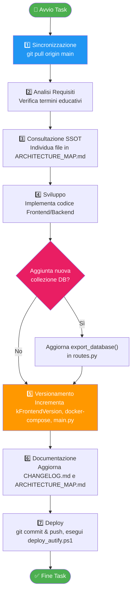
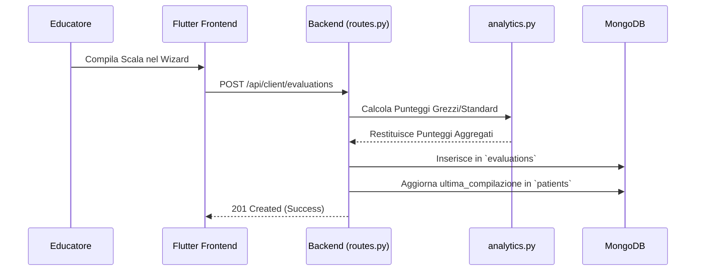
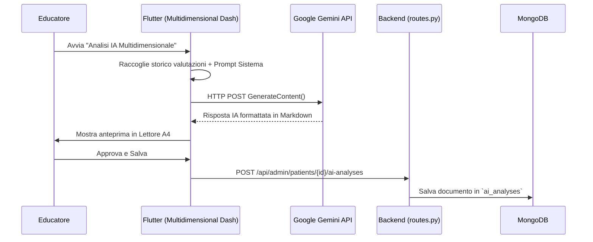
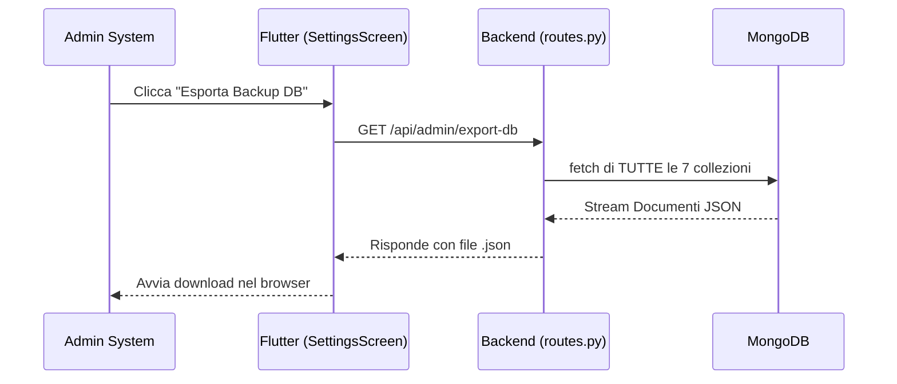

# 🏗️ MAPPA TECNICO-FUNZIONALE: Autify

*Single Source of Truth (SSOT) del Progetto — v2.19.0*

> [!CAUTION]
> **REGOLE DI INGAGGIO E PROTOCOLLO OPERATIVO PER L'AGENTE IA**
> Se sei un assistente IA che sta analizzando o modificando questo progetto, **DEVI OBBEDIRE** a questa sezione prima di procedere. La violazione di questo protocollo causa gravi difformità concettuali e architetturali.

### Regola 1: Contesto Educativo e Vocabolario Obbligatorio
> [!IMPORTANT]
> **NON SIAMO IN UN AMBITO CLINICO/OSPEDALIERO**. Autify è utilizzato esclusivamente all'interno di una **struttura educativa** per utenti autistici. 
> Nei testi della UI, nei commenti e nella reportistica generata dall'IA **SONO CATEGORICAMENTE VIETATI** termini medici.
> *   ✅ **USARE:** "utente", "educatore", "terapista", "struttura educativa", "valutazione", "profilo di funzionamento".
> *   ❌ **NON USARE:** "paziente", "medico", "clinica", "ospedale", "diagnosi medica", "cartella clinica", "malattia".

### Regola 2: Consistenza del Database e Regole di Export
> [!WARNING]
> *   **Database Name**: Il database MongoDB si chiama `autanalysis` (legacy). **NON RINOMINARLO**.
> *   **Export/Import DB**: Ogni volta che viene creata una **nuova collezione MongoDB**, DEVE essere aggiunta esplicitamente al mapping negli endpoint `/export-db` e `/import-db` all'interno di `backend/app/routes.py`. Questo garantisce che i backup di sistema siano sempre integri e portabili.

### Regola 3: Gestione del Ruolo (RBAC)
> [!NOTE]
> Ogni nuova operazione di scrittura (POST/PUT/DELETE) implementata nel backend deve essere obbligatoriamente protetta con `Depends(verify_auth)`. Qualsiasi operazione eseguita dal ruolo `viewer` deve essere bloccata sollevando `403 Forbidden`.

### Regola 4: Workflow Operativo per lo Sviluppo
Segui **sempre** questo ciclo quando sviluppi una nuova funzionalità:


---

## 📑 Indice dell'Architettura

1. [🔭 Overview del Progetto](#1--overview-del-progetto-e-stack-tecnologico)
2. [🔐 Sicurezza & RBAC](#2--sicurezza-e-rbac)
3. [🗂️ Mappa dei Moduli (File-by-File)](#3-️-mappa-dei-moduli-file-by-file)
4. [🗄️ Database e Collezioni](#4-️-database-e-collezioni-mongodb)
5. [🔄 Flussi Dati Architetturali](#5--flussi-dati-architetturali)

---

## 1. 🔭 OVERVIEW DEL PROGETTO E STACK TECNOLOGICO

**Autify** è una piattaforma digitale progettata per la **Fondazione Il Tiglio Onlus**. Digitalizza, somministra, calcola e analizza test e scale multidimensionali per la valutazione della qualità della vita (QoL) e dello sviluppo degli utenti.

### 1.1 Scale Supportate

| Scala | Scopo | Struttura | Esito / Punteggio |
|-------|-------|-----------|-------------------|
| **POS** | Qualità della Vita | 8 domini (SP, AD, RI, IS, D, BE, BF, BM) | Somma grezza diretta |
| **San Martín** | QoL avanzata | 8 domini standard | Conversione psicometrica → Punteggi Standard (1-20), Percentili, Fasce, Indice QdV Globale |
| **SIS** | Intensità Supporti | 6 sottoscale (A-F) + Sezioni 2-3 | Punteggi tridimensionali (Frequenza, Durata, Tipo) → Indice SIS, Rank Priorità |

### 1.2 Stack Tecnologico

> [!TIP]
> L'architettura è interamente dockerizzata e orchestra Backend, Frontend e Database all'interno della stessa rete protetta.

| Layer | Tecnologia | Dettaglio |
|-------|-----------|-----------|
| **Backend** | FastAPI (Python 3.10+) | Asincrono, validazione forte Pydantic, integrazione AI |
| **Database** | MongoDB | Driver `AsyncIOMotorClient`, collezioni destrutturate |
| **Frontend** | Flutter (Dart) | App Web & Desktop responsive, State Management via `Provider` |
| **Generazione Documentale** | Matplotlib + ReportLab | Creazione PDF A4 con grafici a stella/barre e report IA |
| **IA & NLP** | Google Gemini API | Interrogazione via REST API (client-side proxy proxy) |

---

## 2. 🔐 SICUREZZA E RBAC

Il sistema implementa un modello **Role-Based Access Control (RBAC)** con JWT standard crittografici moderni.

### 2.1 Profili di Accesso

| Ruolo | Permessi | Limitazioni |
|-------|----------|-------------|
| **Admin** | CRUD completo su anagrafiche, valutazioni, impostazioni, backup DB. | Non può eliminare l'account di sistema predefinito `admin`. |
| **Viewer** | Sola lettura: dashboard, consultazione valutazioni storiche, export PDF. | Zero permessi di scrittura (REST PUT/POST/DELETE bloccati con HTTP 403). |

### 2.2 Autenticazione (JWT & Bcrypt)
1. L'utente invia `username` e `password` al backend.
2. Il backend verifica l'hash tramite `bcrypt` (rounds=12).
3. Viene generato un JWT (HS256) valido per 8 ore, che codifica `role` e `ai_enabled`.
4. Il frontend archivia il JWT nel `localStorage` e lo inietta in tutte le richieste sotto l'header `Authorization: Bearer <token>`.

---

## 3. 🗂️ MAPPA DEI MODULI (FILE-BY-FILE)

### 3.1 Backend (FastAPI App)

```
backend/app/
├── main.py              # Entrypoint FastAPI, config CORS e registrazione Router
├── auth.py              # Gestione JWT, hashing Bcrypt e rule engine RBAC
├── auth_manager.py      # Gestione log storico accessi
├── database.py          # Connessione Motor asyncio a MongoDB
├── models.py            # Modelli Pydantic (Patient, Evaluation, Scale, AiAnalysis)
├── routes.py            # Core Controller: Espone tutte le rotte API Admin e Client
├── analytics.py         # Motore Psicometrico: Calcola punteggi POS, San Martín, SIS
├── pdf_generator.py     # Assemblaggio in-memory di PDF A4 usando ReportLab e Matplotlib
└── seed_db.py           # Script di semina base del DB (importazione POS da CSV)
```

### 3.2 Frontend Admin (Flutter)

```
frontend_admin/lib/
├── main.dart                                # Router e viewport principale (Responsive)
├── services/
│   ├── api_service.dart                     # Wrapper HTTP per le chiamate REST
│   ├── gemini_service.dart                  # Integrazione client-side Gemini LLM
│   └── settings_notifier.dart               # ChangeNotifier per lo state globale
├── screens/
│   ├── multidimensional_dashboard_screen.dart # Cruscotto IA, radar comparativi e storico
│   ├── sis_wizard_screen.dart               # Wizard compilazione avanzata SIS (drag&drop)
│   ├── evaluation_detail_screen.dart        # Vista di dettaglio della singola valutazione
│   ├── settings_screen.dart                 # Configurazione sistema, API Key, export DB
│   ├── anagrafica_screen.dart               # Gestione CRUD profili utenti/struttura
│   └── document_reader_screen.dart          # Visualizzatore A4 per relazioni generate dall'IA
└── utils/
    └── responsive_helper.dart               # Breakpoints per Desktop vs Tablet vs Mobile
```

---

## 4. 🗄️ DATABASE E COLLEZIONI (MongoDB)

Il DB logico è denominato `autanalysis`. Tutte le collezioni sottostanti fanno parte dello scope di backup dell'applicazione.

| Collezione | Descrizione Dati | Esportato nel JSON di Backup? |
|------------|------------------|:-----------------------------:|
| `patients` | Dati demografici e biologici dell'utente | ✅ Sì |
| `evaluations` | Valutazioni completate (storico punteggi, risposte) | ✅ Sì |
| `scales` | Metadati e alberatura delle scale (Sezioni, Domande) | ✅ Sì |
| `users` | Operatori di sistema (credenziali bcrypt, ruoli) | ✅ Sì |
| `settings` | Chiavi API Gemini, Modello IA in uso, Prompt di sistema | ✅ Sì |
| `ai_analyses` | Storico testuale delle Relazioni IA generate e approvate | ✅ Sì |
| `audit_logs` | Tracciabilità delle operazioni utente (login, creazione, modifica, export) | ✅ Sì |

> [!CAUTION]
> **Aggiunta di nuove collezioni**
> Se nel corso dello sviluppo viene creata una nuova collezione, occorre modificare immediatamente il file `backend/app/routes.py`, in corrispondenza di `export_database()` e `import_database()`, per garantire che la nuova entità venga inserita nel mapping JSON di backup.

---

## 5. 🔄 FLUSSI DATI ARCHITETTURALI

### Flusso 1: Compilazione Valutazione e Calcolo Psicometrico


### Flusso 2: Generazione Relazione IA Multidimensionale


### Flusso 3: Export & Import del Database

