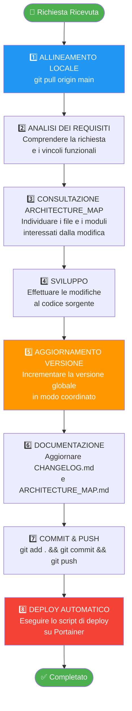
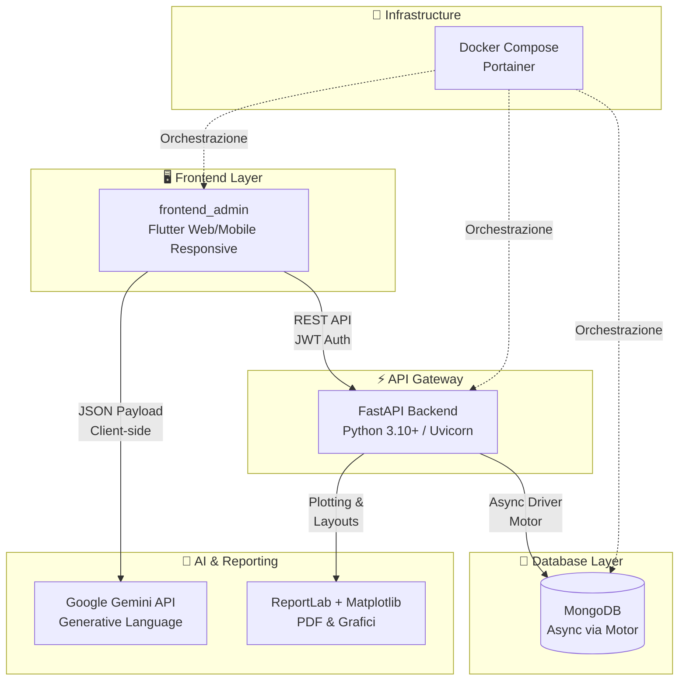
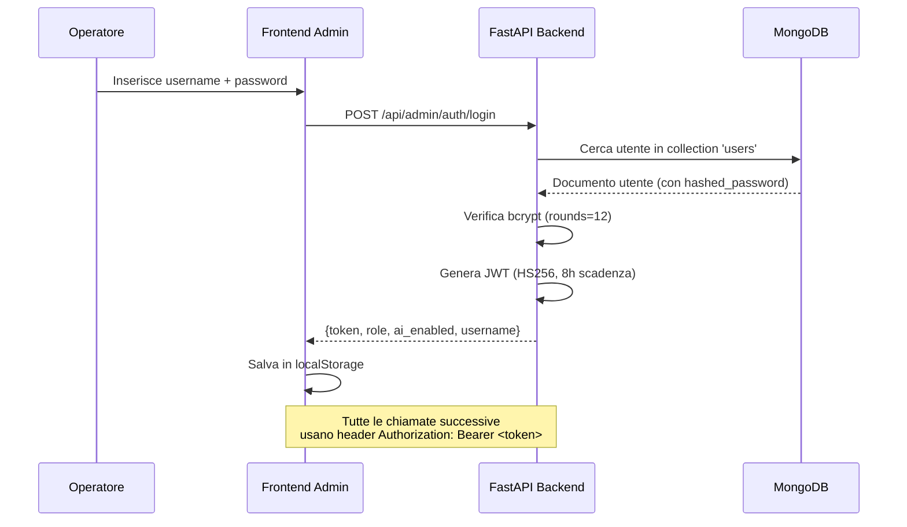
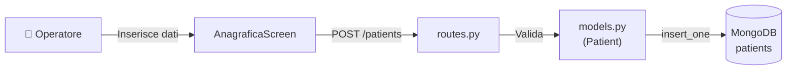
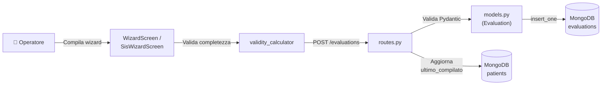
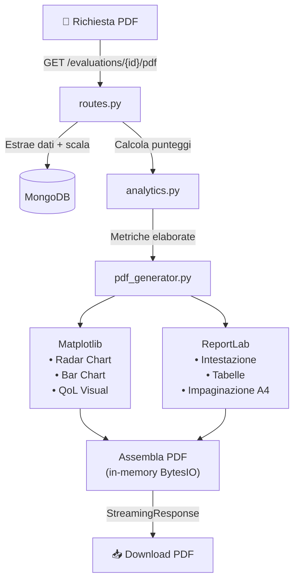
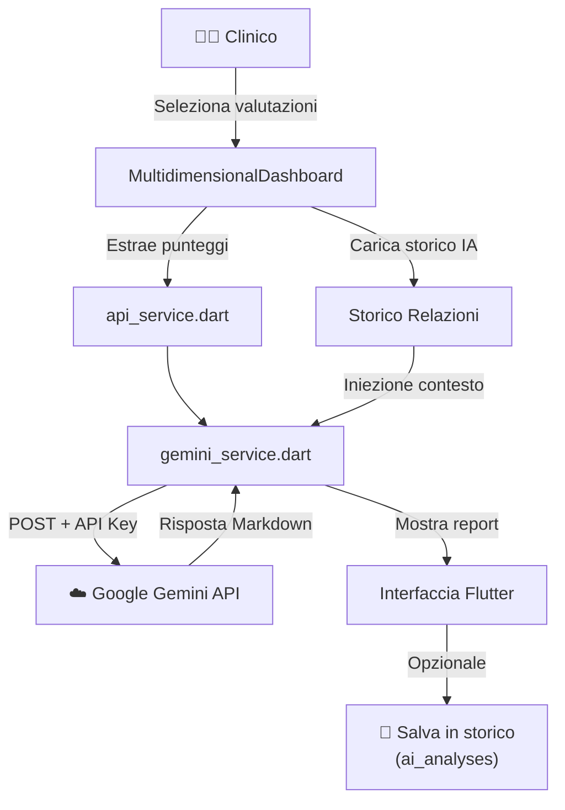

# 🏗️ MAPPA TECNICO-FUNZIONALE: Autify

*Single Source of Truth (SSOT) del Progetto — v2.18.3*

> [!IMPORTANT]
> **DECISIONE ARCHITETTURALE: RIDENOMINAZIONE IN "AUTIFY" & OPZIONE B (DATABASE MONGODB)**
> Il progetto è stato interamente rinominato da **AutAnalysis** a **Autify** in data 28/05/2026.
> Al fine di preservare l'integrità dei dati storici ed evitare rischiose procedure di migrazione:
> * Il nome del database MongoDB rimane invariato a **`autanalysis`** (`client.autanalysis` nel codice backend).
> * Tutte le altre componenti (servizi Docker, proxy Nginx, UI, loghi, PDF) adottano il nuovo brand **`Autify`**.

---

## 📑 Indice

| # | Sezione | Scopo |
|---|---------|-------|
| **0** | [⚙️ Regole di Ingaggio](#0-️-regole-di-ingaggio-rules-of-engagement) | **Workflow obbligatorio per l'IA** — leggere PRIMA di qualsiasi modifica |
| **1** | [🔭 Overview del Progetto](#1--overview-del-progetto-e-stack-tecnologico) | Scopo, scale cliniche supportate, stack tecnologico |
| **2** | [🔐 Sicurezza & RBAC](#2--sicurezza-e-rbac) | Autenticazione JWT, ruoli, profili di accesso |
| **3** | [🗂️ Mappa dei Moduli](#3-️-mappa-dei-moduli-file-by-file) | Documentazione file-by-file di Backend e Frontend |
| **4** | [🗄️ Database](#4-️-database-mongodb) | Collezioni MongoDB e perimetro di backup |
| **5** | [🔄 Flussi Dati](#5--flussi-principali-di-dati) | Diagrammi Mermaid dei 4 flussi operativi |
| **6** | [📋 Mantenimento della SSOT](#6--mantenimento-e-aggiornamento-della-ssot) | Come mantenere aggiornato questo file |

---

## 0. ⚙️ REGOLE DI INGAGGIO (RULES OF ENGAGEMENT)

> [!CAUTION]
> **SEZIONE CRITICA PER L'AGENTE IA**
> Questa sezione definisce il **protocollo operativo obbligatorio** che l'assistente IA deve seguire per ogni attività di sviluppo, manutenzione o evoluzione del sistema Autify.
> La violazione di questo protocollo può causare regressioni, disallineamenti di versione o perdita di dati in produzione.

### 0.1 Workflow Obbligatorio



### 0.2 Dettaglio di Ciascuno Step

| Step | Azione | Comando / Dettaglio |
|------|--------|---------------------|
| **1. Allineamento Locale** | Sincronizzare il workspace con il branch `main` remoto | `git pull origin main` |
| **2. Analisi dei Requisiti** | Analizzare la richiesta ricevuta e i vincoli funzionali del sistema | — |
| **3. Consultazione ARCHITECTURE_MAP** | Leggere questo file per individuare i punti di modifica | Leggere `ARCHITECTURE_MAP.md` |
| **4. Sviluppo** | Effettuare le modifiche al codice secondo le specifiche | — |
| **5. Aggiornamento Versione** | Incrementare la versione globale in tutti i file (vedi tabella sotto) | Vedi §0.3 |
| **6. Documentazione** | Aggiornare `CHANGELOG.md` e, se impatto strutturale, `ARCHITECTURE_MAP.md` | — |
| **7. Commit & Push** | Commit pulito con messaggio descrittivo e push su `main` | `git add . && git commit -m "..." && git push` |
| **8. Deploy** | Eseguire lo script di distribuzione automatica | Vedi §0.4 |

### 0.3 Mappa dei File di Versione (Step 5)

> [!WARNING]
> **Tutti** i file elencati devono essere aggiornati ad ogni rilascio. L'omissione di anche uno solo causa disallineamenti di versione tra i container Docker, il backend e il frontend.

| File | Campo | Esempio |
|------|-------|---------|
| `frontend_admin/lib/app_version.dart` | `kFrontendVersion` | `'2.18.2'` |
| `frontend_admin/pubspec.yaml` | `version` | `2.18.2` |
| `backend/app/main.py` | `version=` nel costruttore `FastAPI(...)` | `"2.18.2"` |
| `docker-compose.yml` | `CACHE_BUST` (×2: backend + frontend) | `2.18.2` |
| `CHANGELOG.md` | Nuova sezione `## [2.18.2] - YYYY-MM-DD` | — |

### 0.4 Comando di Deploy (Step 8)

```powershell
powershell.exe -ExecutionPolicy Bypass -File "C:\Users\gianv\Documents\Progetti\deploy_autify.ps1"
```

Lo script si connette a **Portainer**, arresta lo stack Docker corrente, libera le porte e avvia il redeploy scaricando il codice aggiornato dal repository GitHub.

### 0.5 Vincoli e Convenzioni per l'IA

> [!NOTE]
> **Convenzioni di codice e stile**
> - **Lingua del codice**: Variabili, funzioni e commenti tecnici in **inglese**. Stringhe UI, label e documentazione in **italiano**.
> - **Formato commit**: Usare prefix convenzionali (`feat:`, `fix:`, `build:`, `docs:`, `refactor:`).
> - **RBAC**: Ogni nuova operazione di scrittura (POST/PUT/DELETE) deve essere protetta con `Depends(verify_auth)` e blocco `403 Forbidden` per il ruolo `viewer`.
> - **Backup**: Ogni nuova collezione MongoDB deve essere aggiunta sia all'export (`/export-db`) che all'import (`/import-db`) in `routes.py`.
> - **Database name**: Il database MongoDB si chiama `autanalysis` (legacy). NON rinominarlo.

---

## 1. 🔭 OVERVIEW DEL PROGETTO E STACK TECNOLOGICO

**Autify** è una piattaforma clinica progettata per la **Fondazione Il Tiglio Onlus**. Digitalizza, somministra, calcola e analizza test e scale multidimensionali per la valutazione della qualità della vita (QoL) e dello sviluppo di utenti con disturbo dello spettro autistico e altre disabilità intellettive.

### 1.1 Scale Cliniche Supportate

| Scala | Tipo | Domini | Punteggio |
|-------|------|--------|-----------|
| **POS** (Personal Outcomes Scale) Eterovalutativa | QoL | 8 domini (SP, AD, RI, IS, D, BE, BF, BM) | Somma grezza diretta |
| **San Martín** | QoL avanzata | 8 domini (AU, BE, BF, BM, DI, SP, IS, RI) | Conversione psicometrica → Punteggi Standard (1-20), Percentili, Indice QdV Globale |
| **SIS** (Supports Intensity Scale) | Intensità dei supporti | 6 sottoscale (A-F) + Sezioni 2-3 | Punteggi tridimensionali (Frequenza, Durata, Tipo) → Indice SIS, Classificazione Intensità |

### 1.2 Architettura del Sistema



### 1.3 Stack Tecnologico

| Layer | Tecnologia | Dettaglio |
|-------|-----------|-----------|
| **Backend** | FastAPI (Python 3.10+) | Programmazione asincrona nativa, validazione Pydantic v2 |
| **Database** | MongoDB | Driver asincrono Motor (`AsyncIOMotorClient`), database logico `autanalysis` |
| **Frontend** | Flutter (Dart) | App fully-responsive (Mobile/Desktop), Provider per state management |
| **Grafici & PDF** | Matplotlib + ReportLab | Radar chart ottagonali, bar chart, report A4 pronti per la stampa |
| **AI** | Google Gemini API | Integrazione client-side per relazioni cliniche e raccomandazioni |
| **Infrastruttura** | Docker Compose + Portainer | Container orchestration, deploy automatico da GitHub |

---

## 2. 🔐 SICUREZZA E RBAC

Il sistema implementa un modello **Role-Based Access Control (RBAC)** con standard crittografici moderni.

### 2.1 Meccanismo di Autenticazione



| Componente | Dettaglio |
|-----------|-----------|
| **Hashing** | bcrypt con fattore di costo `12` (rounds=12) |
| **Token** | JWT firmato HS256, scadenza 8 ore, chiave `JWT_SECRET_KEY` |
| **Payload JWT** | `sub` (username), `role` (admin/viewer), `ai_enabled` (bool) |
| **Storage client** | `localStorage`: `jwt_token`, `role`, `ai_enabled`, `username` |
| **Bootstrap** | Al primo avvio, crea automaticamente `admin` / `admin` (password da cambiare) |
| **Retrocompatibilità** | Fallback su header `X-Admin-Password` per moduli legacy |

### 2.2 Profili di Accesso

| Ruolo | Privilegi | Restrizioni |
|-------|-----------|-------------|
| **Admin** | CRUD completo su tutte le risorse. Gestione utenze, import/export DB, configurazione scale e chiavi API, compilazione e cancellazione valutazioni. | Impossibile eliminare il proprio account o l'utente `admin` di sistema. |
| **Viewer** | Sola lettura: consultazione anagrafiche, storico valutazioni, grafici, download PDF. | Tutte le operazioni di scrittura sono disabilitate nella UI e respinte dal backend con `403 Forbidden`. |
| **ai_enabled** | Flag granulare per utente (sia Admin che Viewer). Controlla l'accesso alle funzionalità di generazione report IA (Gemini). | Decodificato dal JWT ad ogni richiesta. |

---

## 3. 🗂️ MAPPA DEI MODULI (FILE-BY-FILE)

### 3.1 Backend (FastAPI App)

```
backend/
├── app/
│   ├── __init__.py
│   ├── main.py              # Entrypoint FastAPI
│   ├── auth.py              # Autenticazione JWT + bcrypt
│   ├── auth_manager.py      # Log accessi + compatibilità legacy
│   ├── database.py          # Connessione MongoDB + collezioni
│   ├── models.py            # Schema Pydantic (Patient, Evaluation, Scale, ecc.)
│   ├── routes.py            # Tutti gli endpoint API (Admin + Client)
│   ├── analytics.py         # Motore psicometrico (POS, San Martín, SIS)
│   ├── pdf_generator.py     # Generazione PDF con Matplotlib + ReportLab
│   ├── seed_db.py           # Import iniziale scala POS da CSV
│   └── assets/
│       └── logo.png         # Logo Fondazione per intestazione PDF
```

---

#### 📄 main.py
* **Path**: `backend/app/main.py`
* **Scopo**: Entrypoint del server backend. Inizializza FastAPI, configura CORS e registra i router.
* **Dettagli**:
  * Evento `@app.on_event("startup")` → chiama `auth.ensure_default_admin()` per assicurare l'utenza admin iniziale.
  * CORS configurato con `allow_origins=["*"]` (in produzione il proxy Nginx filtra i domini).
  * Router registrati: `public_admin_router` e `admin_router` su `/api/admin`, `client_router` su `/api/client`.
  * Endpoint `/` per health check (`{"status": "ok"}`).
* **Dipendenze**: Importa router da `routes.py`, evento startup da `auth.py`. Avviato da Docker via Uvicorn.

---

#### 📄 auth.py
* **Path**: `backend/app/auth.py`
* **Scopo**: Modulo centralizzato di sicurezza: hashing bcrypt, generazione/validazione JWT, dependency `verify_auth`.
* **Dettagli**:
  * Hashing sicuro via `bcrypt` (rounds=12).
  * JWT firmati HS256 con scadenza 8 ore. Eccezioni per firma invalida o token scaduto.
  * Dependency asincrona `verify_auth`: estrae JWT da `Authorization: Bearer <token>`.
  * Fallback retrocompatibile per header legacy `X-Admin-Password`.
  * `ensure_default_admin()`: crea indice unico su `username` e inizializza utente `admin` / `admin` se la collezione è vuota.
* **Dipendenze**: Chiamato da `main.py` (startup) e `routes.py` (come dependency FastAPI).

---

#### 📄 auth_manager.py
* **Path**: `backend/app/auth_manager.py`
* **Scopo**: Gestione del registro accessi su file locale (`viewer_logs.json`) per backward-compatibility.
* **Dettagli**:
  * Legge/scrive `viewer_logs.json` con lock sincrone per prevenire corruzione.
  * Traccia username, ruolo, IP e device di ogni login.
* **Dipendenze**: Importato da `auth.py` (fallback legacy) e `routes.py` (endpoint `GET /auth/logs` e logging login).

---

#### 📄 database.py
* **Path**: `backend/app/database.py`
* **Scopo**: Connessione asincrona a MongoDB ed esposizione di tutte le collezioni.
* **Dettagli**:
  * Utilizza `motor.motor_asyncio.AsyncIOMotorClient`.
  * Stringa di connessione da variabile d'ambiente `MONGODB_URL` (default: `mongodb://localhost:27017`).
  * Database logico: **`autanalysis`** (nome legacy mantenuto per compatibilità dati).
  * Collezioni esposte: vedi [§4 - Database](#4-️-database-mongodb).
* **Dipendenze**: Importato da `routes.py`, `auth.py`, `seed_db.py`.

---

#### 📄 models.py
* **Path**: `backend/app/models.py`
* **Scopo**: Schema formale dei dati (Pydantic v2) per persistenza MongoDB e validazione HTTP.
* **Classi principali**:

| Classe | Descrizione |
|--------|-------------|
| `Patient` | Profilo anagrafico: ID auto-generato (`pat_` + UUID 8 char), dati biologici, indicatori ultima compilazione, flag `attivo` |
| `Scale` → `Section` → `Question` → `Option` | Struttura gerarchica delle scale cliniche |
| `Evaluation` → `Answer` | Compilazione completata con metadati operatore, anno, demographics e risposte |
| `AggregatedEvaluation` / `DomainScore` | Aggregazione punteggi per domini clinici |
| `AppSettings` | Configurazione globale (`gemini_api_key`, `gemini_model` default `gemini-2.5-pro`) |
| `AiAnalysis` / `AiAnalysisCreate` | Report IA salvati nello storico |
| `UserCreate` / `UserUpdate` / `UserResponse` | CRUD utenze operatori |

* **Costante `DOMINI_POS`**: Mappatura codici sezione POS (SP, AD, RI, IS, D, BE, BF, BM) → etichette italiane.

---

#### 📄 analytics.py
* **Path**: `backend/app/analytics.py`
* **Scopo**: Cuore psicometrico del backend. Calcola punteggi grezzi, standard, percentili e Indice QdV globale.
* **Motori di calcolo**:

| Scala | Funzione | Logica |
|-------|----------|--------|
| **POS** | `compute_direct_scores()` | Somma aritmetica dei punteggi grezzi per dominio |
| **San Martín** | `compute_psychometric_analysis()` → `_build_domain_analyses()` | Conversione grezzo → standard (1-20) via `SAN_MARTIN_STANDARD_SCORE_RANGES`, calcolo percentili e fascia (Molto Basso ≤4, Basso ≤7, Medio ≤12, Alto ≤15, Molto Alto >15), Indice QdV globale via `tab_qv` |
| **SIS** | `calcola_punteggi_sis()` | Punteggi tridimensionali (F+D+T), conversione via `SIS_DOMAIN_RANGES` e `SIS_INDEX_TABLE`, estrazione Top 4 priorità, alert medici/comportamentali Sez. 3 |

* **Dipendenze**: Chiamato da `routes.py` (endpoint analisi e PDF) e `pdf_generator.py`.

---

#### 📄 pdf_generator.py
* **Path**: `backend/app/pdf_generator.py`
* **Scopo**: Generazione dinamica di report PDF ad alta risoluzione (A4, margini 1.8cm × 1.4cm).
* **Motore grafico**:
  * `_make_radar_chart(...)`: Radar ottagonale per San Martín con griglia, fascia normativa verde, profilo paziente arancione.
  * `_make_qol_visual_chart(...)`: Griglia multidimensionale con fasce colorate (rosso → verde).
  * `_make_bar_chart(...)`: Bar chart orizzontale per POS e SIS.
* **Costruzione documento**:
  * `_make_letterhead(...)`: Intestazione con logo Fondazione e dati fiscali.
  * `generate_evaluation_pdf(...)`: Assemblaggio completo (demografica + tabelle + grafici in-memory via `io.BytesIO`).
  * `generate_ai_analysis_pdf(...)`: Report PDF dell'analisi IA.
* **Dipendenze**: Riceve dati da `analytics.py`. Invocato da `routes.py`. Logo da `backend/app/assets/logo.png`.

---

#### 📄 routes.py
* **Path**: `backend/app/routes.py`
* **Scopo**: Definizione completa degli endpoint API. Coordina autenticazione, query MongoDB, business logic e risposte.
* **Router**:

| Router | Prefisso | Autenticazione |
|--------|----------|----------------|
| `public_admin_router` | `/api/admin` | Nessuna (solo login e creazione utenti) |
| `admin_router` | `/api/admin` | `Depends(verify_auth)` — JWT obbligatorio |
| `client_router` | `/api/client` | Nessuna (endpoint pubblici per wizard esterno) |

* **Endpoint principali**:

| Metodo | Path | Scopo |
|--------|------|-------|
| `POST` | `/auth/login` | Login JWT |
| `GET` | `/patients` | Lista pazienti ordinata per cognome |
| `POST/PUT/DELETE` | `/patients/{id}` | CRUD paziente |
| `GET` | `/scales` | Lista scale cliniche |
| `POST` | `/import-scale` | Import scala da JSON |
| `GET` | `/evaluations/{patient_id}/{scale_id}` | Storico valutazioni per utente+scala |
| `GET` | `/evaluations/{id}/analysis` | Analisi psicometrica in tempo reale |
| `GET` | `/evaluations/{id}/pdf` | Download PDF report |
| `POST` | `/evaluations/ai-analysis-pdf` | PDF della relazione IA |
| `DELETE` | `/evaluations/{id}` | Eliminazione valutazione (solo Admin) |
| `GET` | `/dashboard-stats` | Statistiche aggregate dashboard |
| `GET/POST/DELETE` | `/patients/ai-analyses/*` | CRUD report IA |
| `GET/POST` | `/users` | Gestione utenze |
| `PUT/DELETE` | `/users/{username}` | Modifica/elimina utente |
| `GET` | `/export-db` | Backup completo DB in JSON |
| `POST` | `/import-db` | Ripristino DB da backup JSON |
| `GET/POST` | `/settings` | Configurazione globale app |

* **Protezione RBAC**: Ogni richiesta POST/PUT/DELETE con ruolo `viewer` riceve `403 Forbidden`.

---

#### 📄 seed_db.py
* **Path**: `backend/app/seed_db.py`
* **Scopo**: Script standalone per import iniziale della scala POS da file CSV.
* **Dettagli**: Usa `csv.Sniffer()` per rilevare il delimitatore. Svuota la collezione `scales` e inserisce l'oggetto `Scale` validato.
* **Dipendenze**: Connessione diretta a MongoDB. Modelli da `models.py`. File sorgente: `backend/app/POS eterovalutativa.xlsx - Foglio1.csv`.

---

### 3.2 Frontend Admin (Flutter)

```
frontend_admin/
├── lib/
│   ├── main.dart                 # Entrypoint app, layout responsive, navigazione
│   ├── config.dart               # Credenziali legacy (backward-compat)
│   ├── app_version.dart          # Costante kFrontendVersion
│   ├── models/
│   │   ├── app_settings.dart     # Modello AppSettings
│   │   ├── evaluation_model.dart # Modelli Evaluation, AggregatedEvaluation, DomainScore
│   │   ├── patient_model.dart    # Modello PatientModel
│   │   └── scale_model.dart      # Modelli Scale, Section, Question, Option
│   ├── screens/
│   │   ├── login_screen.dart                       # Login JWT
│   │   ├── dashboard_screen.dart                   # Dashboard analitica KPI
│   │   ├── anagrafica_screen.dart                  # Gestione profili utenti
│   │   ├── selection_screen.dart                   # Selezione utente + scala
│   │   ├── wizard_screen.dart                      # Wizard compilazione POS/San Martín
│   │   ├── sis_wizard_screen.dart                  # Wizard compilazione SIS
│   │   ├── evaluation_detail_screen.dart           # Cartella clinica + grafici dettaglio
│   │   ├── multidimensional_dashboard_screen.dart  # Cruscotto multidimensionale + IA
│   │   ├── document_reader_screen.dart             # Lettore A4 virtuale report IA
│   │   ├── protocols_screen.dart                   # Visualizzazione scale attive
│   │   ├── settings_screen.dart                    # Impostazioni + gestione utenze
│   │   └── about_terms_dialog.dart                 # Info legali e condizioni d'uso
│   ├── services/
│   │   ├── api_service.dart          # API wrapper HTTP verso il backend
│   │   ├── gemini_service.dart       # Integrazione Google Gemini API
│   │   ├── settings_notifier.dart    # State management globale (ChangeNotifier)
│   │   └── validity_calculator.dart  # Controllo completezza compilazioni
│   ├── widgets/
│   │   ├── sis_3d_item_card.dart     # Card premium per item tridimensionali SIS
│   │   ├── sis_medical_list.dart     # Lista semantica Sezione 3 medica/comportamentale
│   │   └── sis_ranking_widget.dart   # Drag & Drop ranking priorità Sezione 2
│   ├── theme/
│   │   └── app_theme.dart            # Tema Material 3 centralizzato
│   └── utils/
│       └── responsive_helper.dart    # Breakpoint logici (Mobile/Tablet/Desktop)
└── web/
    ├── index.html                    # Viewport e meta SEO
    ├── favicon.png                   # Favicon 512x512
    ├── manifest.json                 # PWA manifest
    └── icons/                        # Icone PWA (192 + 512, standard + maskable)
```

---

#### 📄 main.dart
* **Scopo**: Entrypoint dell'app Flutter. Layout responsive con `NavigationRail` (desktop) o `BottomNavigationBar` + `Drawer` (mobile).
* **State**: `ChangeNotifierProvider` per iniettare `SettingsNotifier` globale.
* **Schermi**: `DashboardScreen`, `AnagraficaScreen`, `ProtocolsScreen`, `SettingsScreen`, `MultidimensionalDashboardScreen`, `SelectionScreen`.

#### 📄 services/api_service.dart
* **Scopo**: API wrapper HTTP verso il backend FastAPI. Incapsula tutte le chiamate di rete.
* **Dettagli**: Usa pacchetto `http`. Legge JWT da `SharedPreferences`. Espone `ApiService.isViewer` per controlli RBAC client-side. Gestisce download PDF come `Uint8List`.

#### 📄 services/gemini_service.dart
* **Scopo**: Integrazione client-side con Google Gemini API per generazione di relazioni cliniche.
* **Dettagli**: Riceve dati anagrafici + analisi psicometrica. Formula prompt clinico strutturato. POST verso `v1beta/models/{model}:generateContent`. Restituisce Markdown. Supporta iniezione dello storico report precedenti per analisi evolutiva longitudinale.

#### 📄 screens/multidimensional_dashboard_screen.dart
* **Scopo**: Cruscotto avanzato di analisi longitudinale multidimensionale. Panoramica integrata POS + San Martín + SIS.
* **Caratteristiche premium**:
  * Layout equalizzato POS/SM con flexbox stretch.
  * Radar chart con 4 dataset sovrapposti (max, range medio, media normativa, paziente).
  * Custom `_RadarLabelsPainter` per badge numerici sui punti del grafico.
  * Animazione particellare `_AntigravityParticleLoader` durante elaborazione IA.
  * Storico relazioni IA con checklist selezione e iniezione contesto.

#### 📄 screens/sis_wizard_screen.dart
* **Scopo**: Wizard orchestratore dedicato alla scala SIS (Supports Intensity Scale).
* **Dettagli**: State management per risposte tridimensionali (F, D, T). `NavigationRail` + `TabBar` scrollabile. Form intake socio-demografico. Drag & Drop ranking priorità (Sez. 2). Alert medici/comportamentali (Sez. 3) con validazione e conferma.

#### 📄 screens/evaluation_detail_screen.dart
* **Scopo**: Cartella clinica dettagliata per singola valutazione. Punteggi, grafici, Indice QdV, sintesi IA.
* **RBAC**: Admin → edit inline + eliminazione record. Viewer → nasconde tutti i pulsanti di modifica.

#### 📄 screens/document_reader_screen.dart
* **Scopo**: Visualizzazione immersiva delle relazioni IA in fogli A4 virtuali.
* **Caratteristiche**: Testata clinica, margini reali, piè di pagina con numerazione. Interruzioni di pagina via `---`. Controlli font, zoom, copia, export PDF. Tre temi: Clinical, Warm, Dark.

---

### 3.3 Infrastruttura & Deploy

#### 📄 docker-compose.yml

| Servizio | Contesto | Porte | Note |
|----------|----------|-------|------|
| `autify-api` | `./backend` | — (interna) | Env: `MONGODB_URL`, `GOOGLE_API_KEY`, `JWT_SECRET_KEY`, `TZ=Europe/Rome` |
| `autify-admin` | `./frontend_admin` | `8090:80` | Servito da Nginx dentro il container |
| `autify-db` | `mongo:latest` | — (interna) | Volume persistente `autify_data:/data/db` |

#### 📄 deploy_autify.ps1
* **Path**: `C:\Users\gianv\Documents\Progetti\deploy_autify.ps1`
* **Scopo**: Script PowerShell per il deploy automatico su Portainer.
* **Flusso**: Richiesta token → arresto stack → attesa rilascio porte → redeploy da Git.

#### 📄 check.py
* **Path**: `check.py` (root del progetto)
* **Scopo**: Utility diagnostica per verificare la correttezza case-sensitive dei path di importazione nei file `.dart`, evitando errori su sistemi Linux (es. container Docker) quando lo sviluppo avviene su Windows.

---

## 4. 🗄️ DATABASE (MongoDB)

### 4.1 Collezioni

| Collezione | Contenuto | Inclusa nel Backup |
|------------|-----------|:------------------:|
| `patients` | Profili anagrafici degli utenti (dati biologici, stato attivo, ultima compilazione) | ✅ |
| `evaluations` | Valutazioni completate (risposte, metadati operatore, demographics) | ✅ |
| `scales` | Definizione delle scale cliniche (sezioni, domande, opzioni) | ✅ |
| `users` | Credenziali operatori (username, hashed_password bcrypt, ruolo, ai_enabled) | ✅ |
| `settings` | Configurazione globale (chiave Gemini mascherata, modello AI attivo) | ✅ |
| `ai_analyses` | Report storici generati dall'IA (relazioni cliniche salvate) | ✅ |

> [!TIP]
> Il perimetro di backup (`/export-db` e `/import-db`) copre **tutte e 6** le collezioni. Un backup esportato da un'installazione può essere ripristinato su un'installazione pulita senza perdita di dati, incluse utenze e report IA.

### 4.2 Connessione

```python
# database.py
client = AsyncIOMotorClient(MONGODB_URL)     # default: mongodb://localhost:27017
database = client.autanalysis                 # ⚠️ Nome legacy mantenuto
```

---

## 5. 🔄 FLUSSI PRINCIPALI DI DATI

### Flusso 1: Creazione Anagrafica Utente



### Flusso 2: Compilazione Valutazione Clinica



### Flusso 3: Report PDF



### Flusso 4: Analisi Multidimensionale con IA



---

## 6. 📋 MANTENIMENTO E AGGIORNAMENTO DELLA SSOT

`ARCHITECTURE_MAP.md` è la **Single Source of Truth** del progetto. Deve essere aggiornata rigorosamente al variare del codice.

### Metodo Guidato (via Assistente Chat)

Ad ogni sviluppo completato, prima di effettuare il commit, lancia questo prompt all'assistente di codifica:

> *"Ho completato le modifiche per la feature X. Scansiona i file modificati (diff), aggiorna l'ARCHITECTURE_MAP.md di conseguenza e poi generami il messaggio di commit."*

### Metodo Automatizzato (Git Hook Pre-Commit)

È possibile automatizzare l'aggiornamento integrando un LLM nelle operazioni Git.

#### Setup:
```bash
touch .git/hooks/pre-commit
chmod +x .git/hooks/pre-commit
```

#### Script:
```bash
#!/bin/bash
# Autify Automated Architecture Map Updater

FILES_CHANGED=$(git diff --cached --name-only | grep -v "ARCHITECTURE_MAP.md")

if [ -z "$FILES_CHANGED" ]; then
    exit 0
fi

echo "🔄 Rilevate modifiche ai seguenti file:"
echo "$FILES_CHANGED"
echo "🧠 Aggiornamento di ARCHITECTURE_MAP.md in corso..."

GIT_DIFF=$(git diff --cached)

if command -v ollama &> /dev/null; then
    RESPONSE=$(curl -s -X POST http://localhost:11434/api/generate -d "{
      \"model\": \"qwen2.5-coder:latest\",
      \"prompt\": \"Sei un Software Architect. Ti fornisco il contenuto attuale del file ARCHITECTURE_MAP.md del progetto Autify ed il Git Diff delle nuove modifiche in corso di commit. Riscrivi l'intero file ARCHITECTURE_MAP.md aggiornandolo affinché rifletta fedelmente il nuovo stato dei file modificati. Mantieni l'esatta struttura originale e non aggiungere commenti esterni alla risposta. Restituisci SOLO il codice markdown del file aggiornato.\n\n=== CONTENUTO CORRENTE ARCHITECTURE_MAP.md ===\n$(cat ARCHITECTURE_MAP.md)\n\n=== GIT DIFF ===\n$GIT_DIFF\",
      \"stream\": false
    }")
    
    NEW_CONTENT=$(echo "$RESPONSE" | grep -o '"response":"[^"]*"' | cut -d'"' -f4 | sed 's/\\n/\n/g' | sed 's/\\t/\t/g')
    
    if [ ! -z "$NEW_CONTENT" ]; then
        echo "$NEW_CONTENT" > ARCHITECTURE_MAP.md
        git add ARCHITECTURE_MAP.md
        echo "✅ ARCHITECTURE_MAP.md aggiornato con successo ed aggiunto al commit!"
    else
        echo "⚠️ Errore nell'estrazione del contenuto del LLM. Aggiorna manualmente."
    fi
else
    echo "💡 Ollama non rilevato in locale. Salto l'aggiornamento automatico della mappa."
    echo "💡 Ricordati di aggiornare ARCHITECTURE_MAP.md manualmente prima di completare il commit!"
fi

exit 0
```
