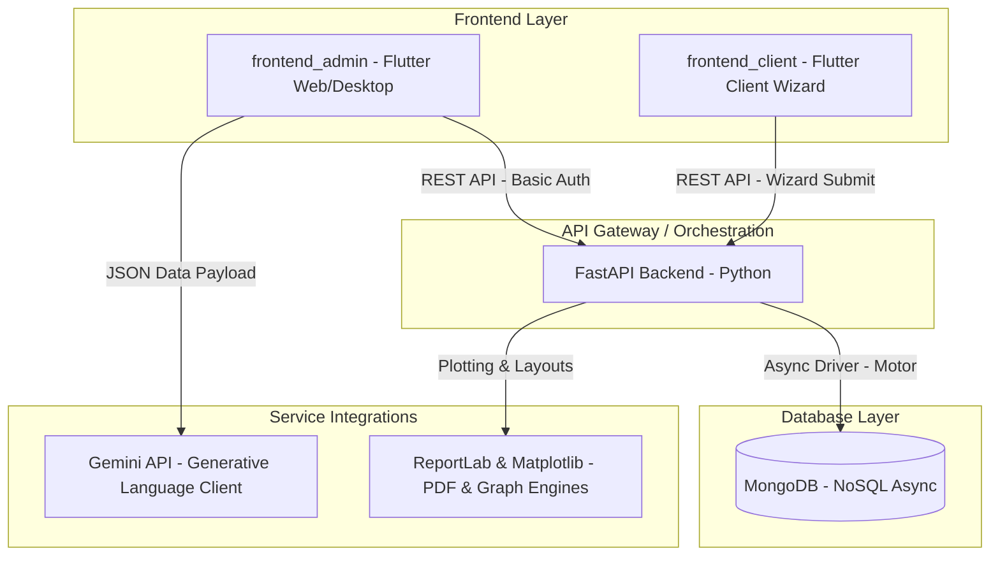

# MAPPA TECNICO-FUNZIONALE: AutAnalysis
*Single Source of Truth (SSOT) del Progetto*

Il presente documento costituisce la Knowledge Base (KB) ufficiale e definitiva del sistema **AutAnalysis**. È progettato per fungere da guida tecnica e funzionale per sviluppatori e software architect, permettendo di individuare a colpo sicuro i punti di modifica e comprendere le interazioni tra i diversi componenti del sistema senza dover svolgere attività di *code discovery*.

---

## 1. OVERVIEW DEL PROGETTO E STACK TECNOLOGICO

**AutAnalysis** è una piattaforma clinica multi-frontend progettata per la **Fondazione Il Tiglio Onlus**. Il suo scopo principale è digitalizzare, somministrare, calcolare e analizzare test e scale multidimensionali per la valutazione della qualità della vita (QoL) e dello sviluppo di pazienti con disturbo dello spettro autistico e altre disabilità intellettive.

Il sistema supporta principalmente due scale cliniche:
1. **Scala POS (Personal Outcomes Scale) Eterovalutativa**: Valutazione della qualità della vita strutturata su 8 domini fondamentali, con un'aggregazione diretta dei punteggi grezzi.
2. **Scala San Martín**: Valutazione multidimensionale avanzata che richiede conversioni psicometriche complesse tramite tabelle normative per ricavare punteggi standard (da 1 a 20), percentili e un Indice Globale della Qualità della Vita (QdV) con relative fasce di classificazione.

### Stack Tecnologico Generale


* **Backend**: **FastAPI** (Python 3.10+), con programmazione asincrona nativa e validazione rigorosa dei dati tramite **Pydantic**.
* **Database**: **MongoDB**, interfacciato asincronamente tramite il driver **Motor** (AsyncIOMotorClient).
* **Frontend Admin**: Applicazione **Flutter (Dart)** incentrata sulla gestione clinica delle anagrafiche, la visualizzazione di dashboard multidimensionali, la configurazione dei protocolli e l'analisi dei dati assistita da Intelligenza Artificiale.
* **Frontend Client (Wizard)**: Applicazione **Flutter (Dart)** ottimizzata per la compilazione rapida e interattiva delle valutazioni da parte di operatori sul campo o caregiver.
* **Motore Grafico & PDF**: **Matplotlib** (per la generazione di radar chart ottagonali e bar chart) e **ReportLab** (per l'assemblaggio di report PDF dinamici pronti per la stampa).
* **AI Analysis**: **Google Gemini API** (tramite integrazione client-side sul frontend amministrativo) per la stesura assistita di relazioni cliniche sintetiche e raccomandazioni multidimensionali.

### 1.1 Sistema di Autenticazione e Gestione degli Accessi (RBAC)

Il sistema implementa un modello **Role-Based Access Control (RBAC)** per garantire la sicurezza delle informazioni e la segregazione dei privilegi, strutturato su due livelli di autorizzazione ben definiti:

1. **Admin (Profilo 1 - Amministratore)**:
   * **Privilegi**: Controllo CRUD completo (Create, Read, Update, Delete).
   * **Operazioni**: Può creare, modificare ed eliminare profili utente, importare/esportare il database, gestire i protocolli e le domande delle scale, configurare la chiave API Gemini e avviare o salvare nuove valutazioni.
2. **Viewer (Profilo 2 - Visualizzatore Sola Lettura)**:
   * **Privilegi**: Accesso in sola lettura (Read-Only).
   * **Operazioni**: Può esclusivamente navigare l'interfaccia, visualizzare l'anagrafica, consultare lo storico dei test, visualizzare i grafici multidimensionali di andamento della Qualità della Vita (QdV) ed esportare i report in PDF. Tutte le azioni di scrittura, inserimento o cancellazione sono disabilitate graficamente a livello di UI e protette a livello di API backend con restituzione di errore HTTP `403 Forbidden`.

---

## 2. MAPPA DEI MODULI (FILE-BY-FILE)

In questa sezione viene dettagliato ciascun file significativo del progetto, specificandone lo scopo aziendale, le caratteristiche tecnologiche e le interdipendenze.

### 2.1 Backend (FastAPI App)

```
backend/
├── app/
│   ├── main.py
│   ├── database.py
│   ├── models.py
│   ├── routes.py
│   ├── analytics.py
│   ├── pdf_generator.py
│   └── seed_db.py
```

---

#### 📄 [main.py](file:///home/gianvito/progetti/AutAnalysis/backend/app/main.py)
* **Path**: `backend/app/main.py`
* **Scopo Funzionale**: Entrypoint principale del server backend. Inizializza l'applicazione FastAPI, definisce i parametri globali delle API, configura le regole di sicurezza per la condivisione delle risorse tra origini differenti (CORS) e registra i moduli di instradamento (router).
* **Dettagli Tecnici**:
  * Classe `FastAPI` istanziata con titolo "AutAnalysis API" e versione `2.2.0`.
  * Middleware `CORSMiddleware` configurato per accettare tutte le origini (`allow_origins=["*"]`) per facilitare lo sviluppo locale e la pubblicazione su domini specifici (es. `https://aut.ghome.it`).
  * Registrazione dei router: `/api/admin` tramite `admin_router` e `/api/client` tramite `client_router`.
  * Endpoint `/` implementato per il controllo dello stato di salute del server (`health_check`).
* **Dipendenze/Relazioni**:
  * Importa e registra `admin_router` e `client_router` da `backend/app/routes.py`.
  * Viene avviato dall'orchestratore di container Docker (`Dockerfile`, `docker-compose.yml`) tramite il server ASGI Uvicorn.

---

#### 📄 [database.py](file:///home/gianvito/progetti/AutAnalysis/backend/app/database.py)
* **Path**: `backend/app/database.py`
* **Scopo Funzionale**: Gestisce il ciclo di vita della connessione al database MongoDB in modalità asincrona non bloccante. Espone gli oggetti di riferimento alle singole collezioni per consentire le operazioni CRUD.
* **Dettagli Tecnici**:
  * Utilizza la libreria `motor.motor_asyncio` tramite la classe `AsyncIOMotorClient`.
  * Legge la stringa di connessione dall'ambiente `MONGODB_URL` (default: `mongodb://localhost:27017`).
  * Istanzia il database logico `autanalysis`.
  * Espone le collezioni MongoDB:
    * `evaluations_collection` (Valutazioni cliniche e risposte ai test)
    * `patients_collection` (Profili anagrafici dei pazienti)
    * `users_collection` (Credenziali di accesso degli operatori)
    * `scales_collection` (Definizione delle scale cliniche e relative domande/sezioni)
    * `settings_collection` (Configurazioni di sistema, comprese le chiavi Gemini mascherate)
* **Dipendenze/Relazioni**:
  * Chiamato da `backend/app/routes.py` per eseguire query sul database.
  * Chiamato da `backend/app/seed_db.py` per caricare e reinizializzare le scale nel database durante il setup.

---

#### 📄 [models.py](file:///home/gianvito/progetti/AutAnalysis/backend/app/models.py)
* **Path**: `backend/app/models.py`
* **Scopo Funzionale**: Definisce lo schema formale dei dati (Data Model) sia per la persistenza su MongoDB sia per la validazione delle richieste e risposte HTTP (Request/Response Payloads). Rappresenta lo specchio delle entità cliniche trattate dal software.
* **Dettagli Tecnici**:
  * Basato interamente su **Pydantic v2** (`BaseModel`, `Field`).
  * Classi Chiave:
    * `Patient`: Gestisce il profilo anagrafico del paziente. Genera automaticamente ID con prefisso (`pat_` + UUID a 8 caratteri), traccia i dati biologici (`altezza`, `peso`, `sesso`, `data_nascita`) e gli indicatori delle ultime compilazioni effettuabili.
    * `AppSettings`: Configurazione globale contenente `gemini_api_key` e `gemini_model` (default: `gemini-1.5-pro`).
    * Struttura della Scala: `Scale` composta gerarchicamente da `Section` (es. sezione "SP" per Sviluppo Personale), che a sua volta contiene una lista di `Question`. Ogni domanda ha un elenco di risposte predefinite regolate dall'oggetto `Option` (testo + punteggio numerico).
    * `Evaluation`: Rappresenta una compilazione completata di un test. Include metadati (`nome_operatore`, `nome_intervistato`, `demographics` aggiuntivi come grado di parentela), l'anno di riferimento e la lista di risposte fornite (`List[Answer]`).
    * `DomainScore` e `AggregatedEvaluation`: Strutture utilizzate per veicolare l'aggregazione dei punteggi suddivisi per domini clinici.
  * Costante `DOMINI_POS`: Mappatura statica dei codici sezione della scala POS (SP, AD, RI, IS, D, BE, BF, BM) alle etichette testuali estese in italiano.
* **Dipendenze/Relazioni**:
  * Importato da `backend/app/routes.py` per tipizzare e convalidare i dati delle API.
  * Importato da `backend/app/analytics.py` per disporre delle definizioni dei punteggi di dominio.
  * Importato da `backend/app/seed_db.py` per la conversione dei file in oggetti validati prima del salvataggio.

---

#### 📄 [analytics.py](file:///home/gianvito/progetti/AutAnalysis/backend/app/analytics.py)
* **Path**: `backend/app/analytics.py`
* **Scopo Funzionale**: È il cuore psicometrico del backend. Calcola i punteggi diretti (grezzi) delle compilazioni, effettua la mappatura verso i punteggi standard (da 1 a 20) per i singoli domini, determina i percentili locali, aggrega la somma complessiva e la converte nell'Indice Globale della Qualità della Vita (QdV) con la relativa fascia di appartenenza normativa.
* **Dettagli Tecnici**:
  * **Matrice San Martín**: La costante `SAN_MARTIN_STANDARD_SCORE_RANGES` definisce i range di conversione per ciascuno degli 8 domini (AU, BE, BF, BM, DI, SP, IS, RI). Converte un punteggio grezzo nel rispettivo punteggio standard da 1 a 17 (e fino a 20).
  * **Tabella B (Indice QdV)**: La costante `tab_qv` contiene la tabella di conversione ufficiale del manuale clinico. Associa la somma dei punteggi standard (range 8–122) al rispettivo Indice QdV globale (media 100, deviazione standard 15) e al percentile globale (es. somma standard 80 -> Indice QdV 100, Percentile 50).
  * Funzioni Principali:
    * `compute_psychometric_analysis(risposte: list, scale_doc: dict) -> dict`: Funzione d'ingresso che rileva la tipologia di scala (POS vs San Martín). Se è presente la tabella di scoring effettua le conversioni complesse, altrimenti esegue una pura somma aritmetica dei punteggi grezzi dei domini (POS).
    * `_build_domain_analyses(...)`: Converte i punteggi grezzi di dominio in punteggi standard, calcolando matematicamente il percentile del dominio e la fascia interpretativa corrispondente (`_std_to_fascia`: "Molto Basso" per standard <=4, "Basso" <=7, "Medio" <=12, "Alto" <=15, "Molto Alto" >15).
    * `_indice_to_fascia(indice: int)`: Determina la fascia globale basata sull'Indice QdV complessivo.
* **Dipendenze/Relazioni**:
  * Chiamato da `backend/app/routes.py` negli endpoint di calcolo analisi (`/evaluations/{evaluation_id}/analysis`) e durante l'esportazione dei report PDF.
  * Fornisce le metriche elaborate a `backend/app/pdf_generator.py`.

---

#### 📄 [pdf_generator.py](file:///home/gianvito/progetti/AutAnalysis/backend/app/pdf_generator.py)
* **Path**: `backend/app/pdf_generator.py`
* **Scopo Funzionale**: Genera dinamicamente report clinici in formato PDF ad altissima risoluzione grafica, pronti per l'archiviazione o la stampa. Integra grafici complessi e tabelle riassuntive del profilo del paziente.
* **Dettagli Tecnici**:
  * Configura **Matplotlib** in modalità non interattiva (`matplotlib.use('Agg')`) per l'esecuzione in contesti server o all'interno di container Docker.
  * Utilizza **ReportLab** (`SimpleDocTemplate`, `Paragraph`, `Table`, `RLImage`, `HRFlowable`) per l'impaginazione di precisione (formato A4 con margini fissati a 1.8 cm laterali e 1.4 cm verticali).
  * **Motore Grafico**:
    * `_make_radar_chart(...)`: Disegna un grafico a radar ottagonale (tela di ragno) per la scala San Martín. Include una griglia poligonale personalizzata, la fascia normativa "Medio" (8-12) evidenziata in verde traslucido, il tracciamento del profilo del paziente in arancione scuro con marcatori di valore circolari ed etichette numeriche per ciascun vertice.
    * `_make_qol_visual_chart(...)`: Reblica la griglia multidimensionale del frontend Flutter, disegnando fasce colorate orizzontali in base ai livelli normativi ("Molto Basso" in rosso, "Molto Alto" in verde).
    * `_make_bar_chart(...)`: Produce un bar chart orizzontale a barre colorate per la scala POS.
  * **Costruzione del Documento**:
    * `_make_letterhead(...)`: Compila l'intestazione ufficiale inserendo il logo della *Fondazione Il Tiglio Onlus* e i dati fiscali dell'ente.
    * `generate_evaluation_pdf(...)`: Riceve i dati anagrafici, le risposte e l'analisi psicometrica elaborata da `analytics.py`. Compila la tabella demografica del paziente, le tabelle di riepilogo clinico, incorpora i grafici generati in memoria come oggetti binari `io.BytesIO` senza salvare file fisici su disco, elenca le singole risposte e restituisce il flusso di byte del PDF finale.
* **Dipendenze/Relazioni**:
  * Utilizza l'output analitico generato da `backend/app/analytics.py`.
  * Viene invocato dall'endpoint `/evaluations/{evaluation_id}/pdf` presente in `backend/app/routes.py`.
  * Carica il logo aziendale dalla cartella locale `backend/app/assets/logo.png`.

---

#### 📄 [routes.py](file:///home/gianvito/progetti/AutAnalysis/backend/app/routes.py)
* **Path**: `backend/app/routes.py`
* **Scopo Funzionale**: Contiene l'intera definizione dei punti di accesso API (routing) sia per il portale amministrativo (`admin_router` con prefisso `/api/admin`) sia per il portale client dei test (`client_router` con prefisso `/api/client`). Esegue le query su MongoDB, coordina la business logic e restituisce le risposte JSON o i file binari.
* **Dettagli Tecnici**:
  * Implementa un sistema di autenticazione integrato (Basic Authentication con `verify_admin_auth`) a due ruoli, che convalida le credenziali `ADMIN_PASSWORD` (per privilegi CRUD completi) e `VIEWER_PASSWORD` (per permessi in sola lettura).
  * Protegge le operazioni di scrittura a livello di API: per qualsiasi richiesta di modifica o cancellazione (POST, PUT, DELETE) inviata con credenziali `Viewer`, solleva un'eccezione HTTP `403 Forbidden` impedendo qualsiasi alterazione del database.
  * Endpoint Amministrativi principali:
    * `GET /patients`: Recupera la lista dei pazienti ordinata per cognome.
    * `POST /patients`: Registra un nuovo paziente con validazione Pydantic.
    * `PUT /patients/{id}` / `DELETE /patients/{id}`: Aggiornamento ed eliminazione logica/fisica del paziente.
    * `GET /scales` / `PUT /scales/{id}` / `DELETE /scales/{id}`: Gestione dei protocolli e delle scale cliniche.
    * `POST /import-scale`: Caricamento dinamico di nuove scale tramite file JSON.
    * `GET /evaluations/{id_patient}`: Recupera lo storico dei test eseguiti da un determinato paziente.
    * `GET /evaluations/{evaluation_id}/pdf`: Restituisce il PDF autogenerato impostando gli header HTTP corretti per il download del file (`application/pdf`).
    * `GET /evaluations/{evaluation_id}/analysis`: Restituisce l'analisi psicometrica elaborata in tempo reale.
    * `DELETE /evaluations/{evaluation_id}`: Rimuove definitivamente una singola valutazione dal database (protetto da RBAC).
    * `GET /dashboard-stats`: Calcola le statistiche riassuntive della dashboard (totale pazienti, numero valutazioni per anno, saturazione dei test).
    * `GET /export-db` / `POST /import-db`: Utility per il backup completo del database MongoDB in formato JSON e per il rispettivo ripristino.
  * Endpoint Client principali:
    * `GET /scales`: Elenca le scale abilitate per la compilazione.
    * `POST /evaluations`: Registra una nuova compilazione proveniente dal wizard esterno. Aggiorna in parallelo la scheda anagrafica del paziente impostando la data dell'ultima compilazione.
* **Dipendenze/Relazioni**:
  * Utilizza le collezioni dichiarate in `backend/app/database.py`.
  * Valida le richieste e risposte tramite le classi di `backend/app/models.py`.
  * Delega i calcoli a `backend/app/analytics.py` e la generazione dei report a `backend/app/pdf_generator.py`.

---

#### 📄 [seed_db.py](file:///home/gianvito/progetti/AutAnalysis/backend/app/seed_db.py)
* **Path**: `backend/app/seed_db.py`
* **Scopo Funzionale**: Script di utilità standalone progettato per importare automaticamente la scala POS da un file CSV sorgente e caricarla nel database MongoDB durante la prima inizializzazione o i ripristini dell'ambiente.
* **Dettagli Tecnici**:
  * Utilizza la libreria standard `csv` abbinata a `csv.Sniffer()` per rilevare dinamicamente i delimitatori di campo del file CSV (virgola o punto e virgola).
  * Analizza la struttura del file mappando le righe singole come intestazioni di sezione (`Section`) e le righe dettagliate come domande cliniche (`Question`).
  * Associa a ciascuna domanda la modalità di risposta standard a 5 opzioni (`rating_1_to_5`).
  * Svuota la collezione `scales` prima dell'inserimento per evitare duplicati e inserisce l'oggetto `Scale` risultante convertito tramite `model_dump()`.
* **Dipendenze/Relazioni**:
  * Si collega direttamente a MongoDB tramite `AsyncIOMotorClient`.
  * Utilizza i modelli di convalida `Scale`, `Section`, `Question` definiti in `backend/app/models.py`.
  * Legge il file sorgente `backend/app/POS eterovalutativa.xlsx - Foglio1.csv`.

---

### 2.2 Frontend Admin (Flutter Admin)

```
frontend_admin/
├── lib/
│   ├── main.dart
│   ├── config.dart
│   ├── models/
│   │   ├── app_settings.dart
│   │   ├── evaluation_model.dart
│   │   ├── patient_model.dart
│   │   └── scale_model.dart
│   ├── screens/
│   │   ├── dashboard_screen.dart
│   │   ├── wizard_screen.dart
│   │   ├── multidimensional_dashboard_screen.dart
│   │   └── anagrafica_screen.dart
│   └── services/
│       ├── api_service.dart
│       ├── gemini_service.dart
│       └── validity_calculator.dart
```

---

#### 📄 [main.dart](file:///home/gianvito/progetti/AutAnalysis/frontend_admin/lib/main.dart)
* **Path**: `frontend_admin/lib/main.dart`
* **Scopo Funzionale**: Punto di partenza dell'applicazione amministrativa. Gestisce l'inizializzazione dello stato, la definizione del tema grafico e la struttura di navigazione principale del portale (composta dalla barra laterale di controllo).
* **Dettagli Tecnici**:
  * Utilizza `ChangeNotifierProvider` per iniettare lo stato globale delle impostazioni (`SettingsNotifier`).
  * Costruisce l'interfaccia utente amministrativa utilizzando un layout responsive con barra laterale (`NavigationRail` o Drawer personalizzato) per alternare i diversi schermi (`DashboardScreen`, `AnagraficaScreen`, `ProtocolsScreen`, `SettingsScreen`, `MultidimensionalDashboardScreen`).
* **Dipendenze/Relazioni**:
  * Inizializza e richiama tutti gli schermi presenti all'interno della cartella `frontend_admin/lib/screens/`.
  * Carica lo stato globale tramite `SettingsNotifier` definito in `services/settings_notifier.dart`.

---

#### 📄 [services/api_service.dart](file:///home/gianvito/progetti/AutAnalysis/frontend_admin/lib/services/api_service.dart)
* **Path**: `frontend_admin/lib/services/api_service.dart`
* **Scopo Funzionale**: Incapsula tutte le chiamate HTTP dirette verso il backend FastAPI, fungendo da strato di astrazione della rete (API Wrapper) per l'intera interfaccia amministrativa.
* **Dettagli Tecnici**:
  * Utilizza il pacchetto Flutter `http` per eseguire richieste asincrone (`GET`, `POST`, `PUT`, `DELETE`).
  * Gestisce dinamicamente le credenziali di sessione leggendole da `SharedPreferences` (permettendo il login flessibile di Admin o Viewer).
  * Espone la proprietà statica `ApiService.isViewer` per determinare istantaneamente in tutta l'app se la sessione corrente è in modalità Sola Lettura.
  * Offre metodi per il recupero delle anagrafiche, delle statistiche della dashboard, delle valutazioni di un paziente e per il caricamento o eliminazione delle scale cliniche e delle valutazioni storiche (`deleteEvaluation`).
  * Gestisce il download dei report PDF come flussi binari (`Uint8List`) pronti per essere visualizzati a schermo o salvati in locale tramite il browser o l'app desktop.
* **Dipendenze/Relazioni**:
  * Legge i dati di connessione da `frontend_admin/lib/config.dart`.
  * Serializza e deserializza i dati di rete mappandoli all'interno delle classi presenti in `frontend_admin/lib/models/`.

---

#### 📄 [services/gemini_service.dart](file:///home/gianvito/progetti/AutAnalysis/frontend_admin/lib/services/gemini_service.dart)
* **Path**: `frontend_admin/lib/services/gemini_service.dart`
* **Scopo Funzionale**: Gestisce l'integrazione client-side con l'API Google Gemini, offrendo un assistente virtuale clinico capace di generare testi di sintesi clinica e raccomandazioni educative per i pazienti.
* **Dettagli Tecnici**:
  * Riceve in input i dati anagrafici del paziente e il dizionario completo dell'analisi psicometrica calcolata dal backend (punteggi standard, fasce, percentili).
  * Formula un prompt clinico strutturato richiedendo a Gemini di analizzare in modo asettico, scientifico ed empatico gli 8 domini della Qualità della Vita.
  * Esegue la richiesta asincrona POST verso l'endpoint ufficiale delle API di Google Generative Language (`v1beta/models/gemini-1.5-pro:generateContent`), autenticandosi tramite la chiave API memorizzata nelle impostazioni locali di `AppSettings`.
  * Restituisce il testo strutturato in formato Markdown da mostrare al clinico.
* **Dipendenze/Relazioni**:
  * Richiama le chiavi configurate e persistite nell'istanza globale di `AppSettings` per ottenere l'autorizzazione di rete.
  * Utilizzato all'interno dello schermo `EvaluationDetailScreen` e `MultidimensionalDashboardScreen` per arricchire la visualizzazione clinica della cartella paziente.

---

#### 📄 [services/validity_calculator.dart](file:///home/gianvito/progetti/AutAnalysis/frontend_admin/lib/services/validity_calculator.dart)
* **Path**: `frontend_admin/lib/services/validity_calculator.dart`
* **Scopo Funzionale**: Controlla la validità e completezza di una somministrazione, calcolando la percentuale di compilazione delle domande e marcando lo stato clinico del test.
* **Dettagli Tecnici**:
  * Definisce la classe di utilità `ValidityCalculator`.
  * Implementa il metodo `calculateValidity(Evaluation evaluation, Scale scale)`: confronta la lista delle domande teoriche definite all'interno della scala con l'elenco delle risposte effettivamente fornite e registrate nell'oggetto evaluation.
  * Restituisce informazioni dettagliate sul numero di risposte mancanti, l'elenco degli ID delle domande omesse e determina se lo stato finale è "Completa" (nessuna omissione) o "Parziale".
* **Dipendenze/Relazioni**:
  * Importa ed elabora le definizioni dei modelli `Evaluation` e `Scale`.
  * Utilizzato dagli schermi interattivi del wizard per segnalare all'utente eventuali risposte non risposte prima dell'invio.

---

#### 📄 [screens/dashboard_screen.dart](file:///home/gianvito/progetti/AutAnalysis/frontend_admin/lib/screens/dashboard_screen.dart)
* **Path**: `frontend_admin/lib/screens/dashboard_screen.dart`
* **Scopo Funzionale**: Schermata iniziale per il personale amministrativo. Offre statistiche aggregate sulle attività cliniche della fondazione (numero pazienti totali, scale caricate, trend di compilazione annuale).
* **Dettagli Tecnici**:
  * Implementa caricamenti asincroni (`FutureBuilder`) interfacciandosi con l'endpoint `/api/admin/dashboard-stats` del backend.
  * Visualizza tessere riassuntive (KPI Cards) per monitorare i dati critici a colpo d'occhio.
* **Dipendenze/Relazioni**:
  * Richiede il servizio `ApiService` per recuperare i dati analitici aggregati dal server.

---

#### 📄 [screens/multidimensional_dashboard_screen.dart](file:///home/gianvito/progetti/AutAnalysis/frontend_admin/lib/screens/multidimensional_dashboard_screen.dart)
* **Path**: `frontend_admin/lib/screens/multidimensional_dashboard_screen.dart`
* **Scopo Funzionale**: Cruscotto avanzato di analisi clinica longitudinale. Permette di confrontare più valutazioni dello stesso paziente nel tempo, evidenziando il trend di miglioramento o peggioramento delle singole aree della Qualità della Vita.
* **Dettagli Tecnici**:
  * Disegna tracciati storici di andamento per ciascuno dei domini.
  * Integra l'assistente basato su `GeminiService` per analizzare i grafici temporali del paziente selezionato e redigere una sintesi delle evoluzioni cliniche.
* **Dipendenze/Relazioni**:
  * Comunica intensamente con `ApiService` (per l'estrazione dello storico delle valutazioni) e con `GeminiService` (per la stesura dell'analisi evolutiva).

---

#### 📄 [screens/wizard_screen.dart](file:///home/gianvito/progetti/AutAnalysis/frontend_admin/lib/screens/wizard_screen.dart)
* **Path**: `frontend_admin/lib/screens/wizard_screen.dart`
* **Scopo Funzionale**: Interfaccia interattiva guidata (Wizard) per la compilazione dei test e delle valutazioni da parte di un operatore.
* **Dettagli Tecnici**:
  * Struttura la compilazione in passaggi logici suddivisi per sezioni della scala selezionata.
  * Integra una protezione client-side all'inizio del metodo `_saveEvaluation()` che controlla `ApiService.isViewer` e impedisce qualsiasi sottomissione o salvataggio dati per gli utenti in sola lettura.
  * Offre controlli in tempo reale per evidenziare le domande saltate prima di inoltrare la richiesta di salvataggio al database.
* **Dipendenze/Relazioni**:
  * Utilizza `validity_calculator.dart` per garantire la correttezza del set di risposte prima del commit sul database.
  * Invia l'oggetto risultante `Evaluation` al backend tramite il metodo di salvataggio di `ApiService`.

---

#### 📄 [screens/anagrafica_screen.dart](file:///home/gianvito/progetti/AutAnalysis/frontend_admin/lib/screens/anagrafica_screen.dart)
* **Path**: `frontend_admin/lib/screens/anagrafica_screen.dart`
* **Scopo Funzionale**: Schermata di gestione dei profili degli utenti (pazienti). Permette di monitorare lo stato di validità delle scale, consultare lo storico dei test, visualizzare i grafici multidimensionali e scaricare i report PDF.
* **Dettagli Tecnici**:
  * Presenta una tabella ordinabile e filtrabile dei pazienti.
  * Implementa restrizioni dinamiche basate sul ruolo Viewer: disabilita completamente il pulsante globale "Aggiungi Utente" e le azioni "Modifica" ed "Elimina" all'interno sia delle schede utente compatte sia della lista tabellare.
* **Dipendenze/Relazioni**:
  * Si appoggia ad `ApiService` per tutte le transazioni di rete riguardanti il ciclo di vita del paziente.

---

#### 📄 [screens/login_screen.dart](file:///home/gianvito/progetti/AutAnalysis/frontend_admin/lib/screens/login_screen.dart)
* **Path**: `frontend_admin/lib/screens/login_screen.dart`
* **Scopo Funzionale**: Schermata di autenticazione per l'accesso alla dashboard amministrativa.
* **Dettagli Tecnici**:
  * Consente il login inserendo la password. Verifica le credenziali sul backend identificando il ruolo associato (`Admin` vs `Viewer`).
  * Salva le credenziali e il ruolo attivo all'interno di `SharedPreferences` per mantenere attiva la sessione.
* **Dipendenze/Relazioni**:
  * Chiama l'endpoint di verifica di `ApiService` per convalidare le password.

---

#### 📄 [screens/settings_screen.dart](file:///home/gianvito/progetti/AutAnalysis/frontend_admin/lib/screens/settings_screen.dart)
* **Path**: `frontend_admin/lib/screens/settings_screen.dart`
* **Scopo Funzionale**: Consente di configurare i parametri globali dell'applicazione, inclusi i tempi di validità delle scale (POS e San Martín), i giorni di preavviso per la scadenza, le chiavi API di Gemini e il modello AI attivo.
* **Dettagli Tecnici**:
  * Gestisce le impostazioni reattive tramite `SettingsNotifier`.
  * Restrizioni Viewer: Disabilita completamente i cursori dei tempi di validità, i pulsanti di "Esporta Database" e "Importa Database", la TextField per l'inserimento della chiave Gemini e la scelta del modello, lasciando l'intera schermata in sola lettura protetta.
* **Dipendenze/Relazioni**:
  * Comunica con `SettingsNotifier` per propagare le modifiche e con `ApiService` per le operazioni di backup del database.

---

#### 📄 [screens/protocols_screen.dart](file:///home/gianvito/progetti/AutAnalysis/frontend_admin/lib/screens/protocols_screen.dart)
* **Path**: `frontend_admin/lib/screens/protocols_screen.dart`
* **Scopo Funzionale**: Schermata per la visualizzazione e la consultazione delle scale di valutazione attive a sistema, con esplorazione interattiva di sezioni, domande e punteggi.
* **Dettagli Tecnici**:
  * Mostra una lista ad alberatura (ExpansionTile) delle scale strutturate.
  * Restrizioni Viewer: Disabilita le azioni di scrittura "Rinomina" ed "Elimina" protocollo, colorando in grigio i rispettivi pulsanti e inibendone il tocco.
* **Dipendenze/Relazioni**:
  * Interroga `ApiService` per caricare le definizioni delle scale salvate a database.

---

#### 📄 [screens/evaluation_detail_screen.dart](file:///home/gianvito/progetti/AutAnalysis/frontend_admin/lib/screens/evaluation_detail_screen.dart)
* **Path**: `frontend_admin/lib/screens/evaluation_detail_screen.dart`
* **Scopo Funzionale**: Cartella clinica e cruscotto dettagliato per la singola valutazione. Mostra i punteggi, le percentuali di dominio, i grafici a barre o a radar, l'indice di Qualità della Vita globale e la sintesi scritta da Gemini.
* **Dettagli Tecnici**:
  * Disegna in modo estremamente personalizzato il profilo psicometrico.
  * Restrizioni Viewer: Nasconde del tutto i pulsanti di modifica ("Edit" e "Salva modifiche") dall'AppBar e i pulsanti "X" per eliminare le singole valutazioni storiche, inibendo qualsiasi alterazione.
  * Modifiche per Admin: Aggiunge la funzionalità per eliminare una singola valutazione dello storico. Il pulsante "X" (cestino o cerchio con croce) è renderizzato nel DOM e cliccabile solo per il ruolo Admin ed esclusivamente se la modalità edit è attiva. Include la gestione di un Dialog premium di conferma e la rimozione reattiva locale dell'elemento senza refresh della pagina.
* **Dipendenze/Relazioni**:
  * Carica i report e le analisi tramite `ApiService` e genera la sintesi clinica tramite `GeminiService`.

---

#### 📄 [screens/selection_screen.dart](file:///home/gianvito/progetti/AutAnalysis/frontend_admin/lib/screens/selection_screen.dart)
* **Path**: `frontend_admin/lib/screens/selection_screen.dart`
* **Scopo Funzionale**: Consente all'operatore di selezionare un utente e una scala per procedere a una nuova sottomissione.
* **Dettagli Tecnici**:
  * Restrizioni Viewer: Disabilita completamente l'avvio della compilazione. Se l'utente attivo è un Viewer, il pulsante d'avvio diventa inattivo e mostra dinamicamente il testo "Sola Lettura - Compilazione Disabilitata".
* **Dipendenze/Relazioni**:
  * Naviga verso `WizardScreen` per avviare la compilazione in caso di sessione amministrativa con ruolo Admin.

---

### 2.3 Frontend Client (Flutter Client)

```
frontend_client/
├── lib/
│   ├── main.dart
│   ├── screens/
│   │   └── wizard_screen.dart
│   └── services/
│       └── api_service.dart
```

---

#### 📄 [main.dart](file:///home/gianvito/progetti/AutAnalysis/frontend_client/lib/main.dart)
* **Path**: `frontend_client/lib/main.dart`
* **Scopo Funzionale**: Entrypoint dell'applicazione client semplificata. Questo frontend è espressamente dedicato alla compilazione rapida a schermo (es. su tablet all'interno dei centri o da remoto da parte della famiglia/caregiver).
* **Dettagli Tecnici**:
  * Presenta un'interfaccia focalizzata e minimale. Evita l'accesso alle statistiche amministrative o alle impostazioni di sistema.
  * Permette all'utente di selezionare il paziente dall'anagrafica abilitata (in modalità protetta) e avviare immediatamente lo schermo del wizard di valutazione.
* **Dipendenze/Relazioni**:
  * Istanzia lo schermo wizard dedicato presente in `frontend_client/lib/screens/wizard_screen.dart`.

---

#### 📄 [screens/wizard_screen.dart](file:///home/gianvito/progetti/AutAnalysis/frontend_client/lib/screens/wizard_screen.dart)
* **Path**: `frontend_client/lib/screens/wizard_screen.dart`
* **Scopo Funzionale**: Fornisce un wizard interattivo per la compilazione dei test clinici POS e San Martín, ottimizzato per utenti non prettamente tecnici o per compilazioni self-report.
* **Dettagli Tecnici**:
  * Interfaccia a forte componente visiva, pulsanti di risposta ad area espansa per facilitare il tocco su dispositivi mobili/tablet.
  * Tracciamento dello stato di completamento e avanzamento tramite indicatori percentuali lineari.
* **Dipendenze/Relazioni**:
  * Salva le risposte inoltrando la valutazione all'endpoint pubblico `/api/client/evaluations` esposto dal backend, tramite l'intermediazione del file `services/api_service.dart` locale.

---

### 2.4 Utilità di Root (Validator)

---

#### 📄 [check.py](file:///home/gianvito/progetti/AutAnalysis/check.py)
* **Path**: `check.py`
* **Scopo Funzionale**: Script Python di utilità diagnostica utilizzato per verificare la correttezza formale e la coerenza del case-sensitivity dei percorsi di importazione all'interno dell'applicazione Dart/Flutter.
* **Dettagli Tecnici**:
  * Utilizza espressioni regolari per scansionare i file `.dart` presenti nella directory `frontend_admin/lib`.
  * Estrae le istruzioni di importazione relative (es. `import 'models/app_settings.dart'`).
  * Effettua un controllo incrociato controllando l'esatta corrispondenza dei caratteri maiuscoli/minuscoli dei file sul filesystem reale per evitare anomalie di compilazione su sistemi operativi Linux (che sono case-sensitive) quando lo sviluppo avviene su Windows (che è case-insensitive).
* **Dipendenze/Relazioni**:
  * Eseguito manualmente o tramite catene di integrazione continua (CI/CD) prima di effettuare il build dei frontend Flutter.

---

## 3. FLUSSI PRINCIPALI DI DATI (DATA FLOW)

Di seguito sono descritti i 4 flussi operativi fondamentali che governano il sistema AutAnalysis.

### Flusso 1: Creazione e Sincronizzazione dell'Anagrafica Paziente
Questo flusso registra un nuovo profilo clinico e lo rende disponibile per le valutazioni.

```
[Operatore] ──(Inserisce Dati)──> [AnagraficaScreen (Flutter Admin)]
                                             │
                                   (Invia POST JSON)
                                             │
                                             ▼
                                  [routes.py (FastAPI)]
                                             │
                                   (Valida con Pydantic)
                                             │
                                             ▼
                                  [models.py (Patient)]
                                             │
                                     (Salva Record)
                                             │
                                             ▼
                                   [(MongoDB - patients)]
```

---

### Flusso 2: Compilazione della Valutazione Clinica (POS & San Martín)
Questo flusso gestisce l'inserimento dei punteggi forniti durante l'intervista clinica.

```
[Operatore/Caregiver] ──(Compila Wizard)──> [WizardScreen (Admin/Client)]
                                                     │
                                           (Valida Completezza)
                                                     │
                                                     ▼
                                      [validity_calculator.dart]
                                                     │
                                           (Invia POST JSON)
                                                     │
                                                     ▼
                                            [routes.py (API)]
                                                     │
                                           (Valida con Pydantic)
                                                     │
                                                     ▼
                                          [models.py (Evaluation)]
                                                     │
                                           (Salva Valutazione)
                                                     │
                                                     ▼
                                         [(MongoDB - evaluations)]
                                                     │
                                          (Aggiorna ultimo_compilato)
                                                     │
                                                     ▼
                                          [(MongoDB - patients)]
```

---

### Flusso 3: Calcolo Psicometrico e Generazione del Report PDF
Questo flusso trasforma le risposte in grafici clinici e report formattati pronti per la stampa.

```
[Richiesta PDF] ──> [routes.py (GET /evaluations/{id}/pdf)]
                                │
                        (Estrae Dati & Scala)
                                │
                                ▼
                       [(MongoDB Collections)]
                                │
                    (Calcola Standard & QdV)
                                │
                                ▼
                      [analytics.py (Engine)]
                                │
                 (Invia Punteggi ed Elaborazioni)
                                │
                                ▼
                     [pdf_generator.py (PDF)]
                                │
             ┌──────────────────┴──────────────────┐
             ▼                                     ▼
     (Matplotlib Engine)                  (ReportLab Document)
     - Disegna Radar Chart                - Impagina Intestazione
     - Genera Bar Chart                   - Crea Tabelle Dati
             │                                     │
             └──────────────────┬──────────────────┘
                                │
                         (Assembla PDF)
                                │
                                ▼
                     [Flusso Binario (Bytes)] ──> [Browser / Download PDF]
```

---

### Flusso 4: Analisi Multidimensionale con IA (Gemini Synthesis)
Questo flusso assiste il clinico riassumendo l'andamento multidimensionale e fornendo raccomandazioni cliniche automatiche.

```
[Clinico] ──(Seleziona Valutazione/i)──> [MultidimensionalDashboardScreen]
                                                    │
                                         (Estrae Punteggi & Analisi)
                                                    │
                                                    ▼
                                          [api_service.dart]
                                                    │
                                          (Costruisce Prompt)
                                                    │
                                                    ▼
                                          [gemini_service.dart]
                                                    │
                                        (Invia Dati + API Key)
                                                    │
                                                    ▼
                                            [Google Gemini API]
                                                    │
                                            (Elabora Sintesi)
                                                    │
                                                    ▼
[Testo Markdown Clinico] <──(Mostra Risposta)── [Interfaccia Flutter Admin]
```

---

## 4. REGOLE DI MANTENIMENTO E AGGIORNAMENTO AUTOMATIZZATO (GIT HOOK)

`ARCHITECTURE_MAP.md` è la **Single Source of Truth** del progetto. Per garantire che non diventi obsoleta, deve essere aggiornata rigorosamente al variare del codice.

### A. Il Metodo Guidato (Via Assistente Chat)
Ad ogni sviluppo completato, prima di effettuare il commit, lancia questo prompt all'assistente di codifica:
> *"Ho completato le modifiche per la feature X. Scansiona i file modificati (diff), aggiorna l' ARCHITECTURE_MAP.md di conseguenza e poi generami il messaggio di commit."*

---

### B. Il Metodo Automatizzato (Git Hook Pre-Commit)
È possibile automatizzare l'aggiornamento integrando un LLM direttamente all'interno delle operazioni di Git. Di seguito viene fornito uno script in Bash pronto all'uso come pre-commit hook.

#### Setup del Git Hook:
1. Crea un file chiamato `pre-commit` all'interno della cartella `.git/hooks/` nella root del progetto:
   `touch .git/hooks/pre-commit`
2. Rendi lo script eseguibile:
   `chmod +x .git/hooks/pre-commit`
3. Copia all'interno del file il codice seguente:

```bash
#!/bin/bash
# AutAnalysis Automated Architecture Map Updater
# Questo hook rileva le modifiche, le invia ad un modello di linguaggio locale o remoto
# per aggiornare ARCHITECTURE_MAP.md in modo trasparente ad ogni commit.

# Rileva i file modificati in stage (escludendo ARCHITECTURE_MAP.md stesso)
FILES_CHANGED=$(git diff --cached --name-only | grep -v "ARCHITECTURE_MAP.md")

if [ -z "$FILES_CHANGED" ]; then
    exit 0
fi

echo "🔄 Rilevate modifiche ai seguenti file:"
echo "$FILES_CHANGED"
echo "🧠 Aggiornamento di ARCHITECTURE_MAP.md in corso..."

# Ottieni il diff completo delle modifiche pronte per il commit
GIT_DIFF=$(git diff --cached)

# Esempio di invocazione tramite CLI di un modello locale (es. Ollama con qwen2.5-coder o gemma)
# Se utilizzi un'API Cloud (es. Gemini API), puoi sostituire curl con la chiave API opportuna.
if command -v ollama &> /dev/null; then
    RESPONSE=$(curl -s -X POST http://localhost:11434/api/generate -d "{
      \"model\": \"qwen2.5-coder:latest\",
      \"prompt\": \"Sei un Software Architect. Ti fornisco il contenuto attuale del file ARCHITECTURE_MAP.md del progetto AutAnalysis ed il Git Diff delle nuove modifiche in corso di commit. Riscrivi l'intero file ARCHITECTURE_MAP.md aggiornandolo affinché rifletta fedelmente il nuovo stato dei file modificati. Mantieni l'esatta struttura originale e non aggiungere commenti esterni alla risposta. Restituisci SOLO il codice markdown del file aggiornato.\n\n=== CONTENUTO CORRENTE ARCHITECTURE_MAP.md ===\n$(cat ARCHITECTURE_MAP.md)\n\n=== GIT DIFF ===\n$GIT_DIFF\",
      \"stream\": false
    }")
    
    # Estrai la risposta JSON e sovrascrivi il file
    NEW_CONTENT=$(echo "$RESPONSE" | grep -o '"response":"[^"]*"' | cut -d'"' -f4 | sed 's/\\n/\n/g' | sed 's/\\t/\t/g')
    
    if [ ! -z "$NEW_CONTENT" ]; then
        echo "$NEW_CONTENT" > ARCHITECTURE_MAP.md
        # Aggiunge nuovamente il file aggiornato allo stage per includerlo nel commit corrente
        git add ARCHITECTURE_MAP.md
        echo "✅ ARCHITECTURE_MAP.md aggiornato con successo ed aggiunto al commit!"
    else
        echo "⚠️ Errore nell'estrazione del contenuto del LLM. Aggiorna manualmente."
    fi
else
    echo "💡 Ollama non rilevato in locale. Salto l'aggiornamento automatico della mappa."
    echo "💡 Ricordati di aggiornare ARCHITECTURE_MAP.md manualmente prima di completare il commit!"
fi

exit 0
```
