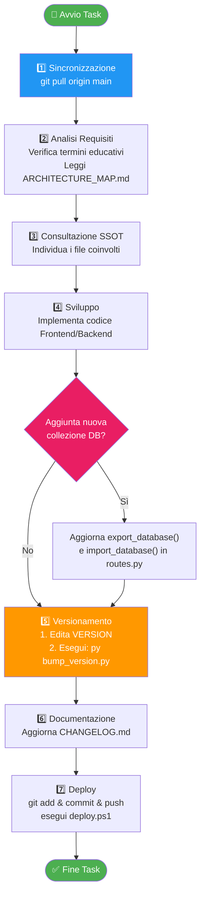
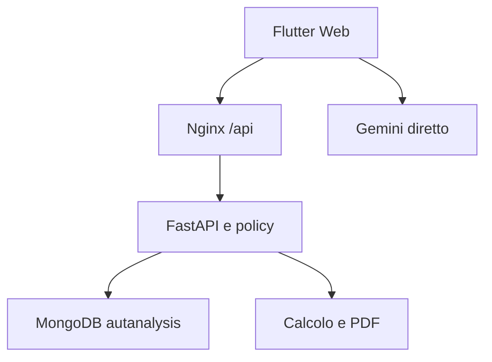

# 🏗️ MAPPA TECNICO-FUNZIONALE: Autify

Single Source of Truth (SSOT) del Progetto — v3.1.0

> [!CAUTION]
> **REGOLE DI INGAGGIO E PROTOCOLLO OPERATIVO PER L'AGENTE IA**
> Se sei un assistente IA che sta analizzando o modificando questo progetto, **DEVI OBBEDIRE** a questa sezione prima di procedere. La violazione di questo protocollo causa gravi difformità concettuali e architetturali.

## Regole di Ingaggio per l'Agente IA

### Regola 1: Contesto Educativo e Vocabolario Obbligatorio

> [!IMPORTANT]
> **NON SIAMO IN UN AMBITO CLINICO/OSPEDALIERO**. Autify è utilizzato esclusivamente all'interno di una **struttura educativa** per utenti autistici.
> Nei testi della UI, nei commenti e nella reportistica generata dall'IA **SONO CATEGORICAMENTE VIETATI** termini medici.
>
> * ✅ **USARE:** "utente", "educatore", "terapista", "struttura educativa", "valutazione", "profilo di funzionamento".
> * ❌ **NON USARE:** "paziente", "medico", "clinica", "ospedale", "diagnosi medica", "cartella clinica", "malattia".

### Regola 2: Consistenza del Database e Regole di Export

> [!WARNING]
>
> * **Database Name**: Il database MongoDB si chiama `autanalysis` (legacy). **NON RINOMINARLO**.
> * **Export/Import DB**: Ogni volta che viene creata una **nuova collezione MongoDB**, DEVE essere aggiunta esplicitamente al mapping negli endpoint `/export-db` e `/import-db` all'interno di `backend/app/routes.py`. Questo garantisce che i backup di sistema siano sempre integri e portabili.

### Regola 3: Gestione del Ruolo (RBAC)

> [!NOTE]
> Ogni nuova operazione di scrittura (POST/PUT/DELETE) implementata nel backend deve essere obbligatoriamente protetta con `Depends(verify_auth)`. Qualsiasi operazione eseguita dal ruolo `viewer` deve essere bloccata sollevando `403 Forbidden`.

### Regola 4: Versionamento — Fonte Unica di Verità

> [!IMPORTANT]
> Il file `VERSION` nella root del progetto è l'**unica fonte di verità** per la versione. Non modificare mai la versione direttamente nei file derivati.
>
> **Procedura obbligatoria per ogni release:**
>
> 1. Edita `VERSION` con la nuova versione (es. `2.21.0`)
> 2. Esegui `py bump_version.py` dalla root — propaga automaticamente a:
>    * `backend/app/main.py` → campo `version=`
>    * `frontend_admin/pubspec.yaml` → campo `version:`
>    * `frontend_admin/lib/app_version.dart` → `kFrontendVersion`
>    * `docker-compose.yml` → `CACHE_BUST=`
>    * `ARCHITECTURE_MAP.md` → versione nel sottotitolo
> 3. Durante il Docker build, `tools/update_version.dart` rigenera `app_version.dart` da `pubspec.yaml` come garanzia aggiuntiva.

### Regola 5: Workflow Operativo per lo Sviluppo

Segui **sempre** questo ciclo quando sviluppi una nuova funzionalità:

```mermaid
flowchart TD
    START([🚀 Avvio Task]) --> PULL

    PULL["1️⃣ Sincronizzazione\ngit pull origin main"] --> ANALYZE

    ANALYZE["2️⃣ Analisi Requisiti\nVerifica termini educativi\nLeggi ARCHITECTURE_MAP.md"] --> ARCH

    ARCH["3️⃣ Consultazione SSOT\nIndividua i file coinvolti"] --> DEV

    DEV["4️⃣ Sviluppo\nImplementa codice Frontend/Backend"] --> DB_CHECK

    DB_CHECK{"Aggiunta nuova\ncollezione DB?"}
    DB_CHECK -- Sì --> UPDATE_EXPORT["Aggiorna export_database()\ne import_database() in routes.py"]
    DB_CHECK -- No --> VERSION

    UPDATE_EXPORT --> VERSION

    VERSION["5️⃣ Versionamento\n1. Edita VERSION\n2. Esegui: py bump_version.py"] --> DOCS

    DOCS["6️⃣ Documentazione\nAggiorna CHANGELOG.md"] --> COMMIT

    COMMIT["7️⃣ Deploy\ngit add & commit & push\nesegui deploy.ps1"] --> DONE([✅ Fine Task])

    style START fill:#4CAF50,color:#fff
    style DONE fill:#4CAF50,color:#fff
    style PULL fill:#2196F3,color:#fff
    style VERSION fill:#FF9800,color:#fff
    style DB_CHECK fill:#E91E63,color:#fff
```

### Regola 6: Build e deploy — fonti verificate e contesto esterno

Il repository corrente è `RazorCopter/Autify`, branch `main`. Il codice verifica questa catena: Compose avvia MongoDB, backend FastAPI e frontend Nginx; il Dockerfile frontend compila Flutter Web e aggiorna app_version.dart dal pubspec. Nginx espone la UI e inoltra /api/ al backend.

Il deploy via script Windows `deploy.ps1` e Portainer stack 140 è **contesto operativo dichiarato in precedenza, non verificato dall’assessment**: lo script non è versionato qui. Non risultano workflow GitHub Actions. La produzione dichiarata è `https://tiglio.autify.it`; Compose pubblica 8090:80 e usa il volume `autify_data`. L’assessment non ha interrogato Portainer né eseguito un deploy.

---

## Mappa verificata — ricognizione e assessment

Snapshot assessment: commit `cad2ca2714796d3199152e1d5a49c143df9d8fbc` su `main`, 12 settembre 2026. Il codice applicativo coincide con quello della ricognizione iniziale (`13b375e316fb2e17e69f28ebcb7aeb1b26dec2c0`); il commit intermedio aveva modificato solo questa mappa.

**Valutazione:** la separazione Flutter / FastAPI / MongoDB è adeguata come base; non emerge la necessità di sostituire lo stack. Esistono però blocchi verificati su autorizzazioni, integrità del ripristino, coerenza dei calcoli e provenienza dei dati IA. La presenza di JWT e test non basta a considerare l’app pronta sotto questi aspetti.

Questo file è il riferimento centrale per architettura e contratti. [REMEDIATION.md](REMEDIATION.md) contiene il registro completo degli interventi, evidenze e criteri di chiusura. **Nessun fix funzionale è stato applicato**: tutte le descrizioni del comportamento corrente qui sotto sono separate dalle decisioni proposte.

Inventario completo di 107 file e 37 endpoint applicativi espliciti (incluso health; esclusi endpoint automatici OpenAPI/docs). Lettura mirata del codice, esecuzione suite Python e 16 verifiche aggiuntive ASGI/pure con dati sintetici. Ultima suite: **20 passed, 1 failed** dopo aver risolto solo localmente un’incompatibilità httpx; dettagli nella sezione 7. Nessun test contro produzione, Gemini o MongoDB reale; nessuna build Flutter/Docker e nessuna certificazione normativa delle tabelle.

| Area | Stato osservato | Azione collegata |
| --- | --- | --- |
| Autorizzazioni | API client anonime; backup completo ai viewer | SEC-01, SEC-02 — P0 |
| Identità e segreti | Sessioni non revocate, bootstrap prevedibile, credenziali in script | SEC-03, SEC-04, SEC-05 |
| Dati | Restore può cancellare prima di validare; riferimenti e versioni fragili | DATA-01, DATA-02, DATA-03 |
| Indicatori e punteggi | Date/filtro incoerenti, SIS vuota con indice, tabelle da riconciliare | FUN-01, FUN-02, SCORE-01, SCORE-02 |
| IA | Indici recenti associati allo storico; chiave nel browser; autosalvataggio | AI-01, AI-02 |
| Rilascio e qualità | Versioni discordanti, cache asset, suite incompleta e limiti di volume | OPS-01, QA-01, PERF-01, OBS-01, UI-01, ARCH-01 |

### Relazioni fra componenti

```mermaid
flowchart TD
    UI["Flutter Web"] --> NGINX["Nginx /api"]
    NGINX --> API["FastAPI e policy"]
    API --> DB["MongoDB autanalysis"]
    API --> CALC["Calcolo e PDF"]
    UI --> GEM["Gemini diretto"]
```

Il collegamento diretto UI → Gemini è il comportamento corrente. Il servizio IA backend è una proposta di AI-02, non un componente già implementato.

### 1. Prodotto e confini

Autify supporta una struttura educativa con anagrafiche utenti, somministrazione e storico valutazioni, scale POS, San Martín, SIS, OGVA, SABS e OSO, dashboard, relazioni IA e documenti PDF. La presenza dei percorsi e dei dati non certifica la validità delle conversioni o di ogni scala: incompletezza e fonti di scoring sono trattate in SCORE-01/SCORE-02.

| Livello | Implementazione osservata |
| --- | --- |
| UI | Flutter Web, Provider per settings, HTTP, fl_chart, flutter_markdown, file_picker |
| API | FastAPI; router admin protetto, router pubblico admin e router client separati |
| Dati | Motor / MongoDB; database legacy `autanalysis`; sette collezioni |
| Calcolo | `analytics.py`: punteggi diretti, conversioni San Martín, motore SIS |
| Documenti | `pdf_generator.py`: ReportLab + Matplotlib, PDF valutazioni e relazioni IA |
| IA | `gemini_service.dart` chiama direttamente Google Gemini via HTTP dal frontend |
| Runtime | Docker Compose: autify-admin → autify-api → autify-db |

Il target verificato è Web: `main.dart` e `api_service.dart` importano `dart:html`; il supporto Desktop non è dimostrato.

### 2. Mappa funzionale dei moduli

Tutti i percorsi UI seguenti sono relativi a `frontend_admin/lib/`.

| Area | File principali | Responsabilità / collegamenti |
| --- | --- | --- |
| Avvio e navigazione | main.dart, config.dart, app_version.dart | Shell, sessione browser, selezione schermate, URL API e versione |
| Accesso | screens/login_screen.dart, services/api_service.dart | Login JWT, localStorage, header Bearer e gestione 401 |
| Configurazione | screens/settings_screen.dart, services/settings_notifier.dart, models/app_settings.dart | Gemini/utenze/backup via API; durate e alert in SharedPreferences locali, non nel backup DB |
| Anagrafiche | screens/anagrafica_screen.dart, models/patient_model.dart | CRUD, ricerca, filtri, paginazione e storico |
| Scale | screens/protocols_screen.dart, models/scale_model.dart | Import e gestione protocolli |
| Compilazione | screens/selection_screen.dart, screens/wizard_screen.dart, screens/sis_wizard_screen.dart | Selezione utente/scala, risposte generiche e percorso SIS |
| Demografia | widgets/demographics_form.dart | Form condiviso |
| SIS | widgets/sis_3d_item_card.dart, widgets/sis_medical_list.dart, widgets/sis_ranking_widget.dart | Componenti delle tre sezioni; nomi file legacy conservati |
| Dashboard | screens/dashboard_screen.dart, services/validity_calculator.dart | Indicatori, scadenze e validità |
| Dettagli | screens/evaluation_detail_screen.dart, models/evaluation_model.dart | Storico, risposte, analisi, modifica e PDF |
| Multidimensionale | screens/multidimensional_dashboard_screen.dart, services/gemini_service.dart | Confronto scale, contesto IA, note/allegati/storico |
| Relazioni | screens/document_reader_screen.dart | Lettura e presentazione documento |
| Audit | screens/audit_log_screen.dart, models/audit_log.dart | Consultazione eventi |
| UI condivisa | theme/app_theme.dart, utils/responsive_helper.dart, widgets/expandable_scale_card.dart, widgets/connection_status_indicator.dart | Tema, layout, card e stato connessione |
| Informazioni | screens/about_terms_dialog.dart | Informazioni e condizioni |

| Backend | Responsabilità |
| --- | --- |
| backend/app/main.py | Entrypoint, lifespan, bootstrap, CORS, limiter, montaggio router e health |
| backend/app/auth.py | JWT HS256 (8 ore), bcrypt (12 round), bootstrap, indici e migrazione campo attivo |
| backend/app/database.py | Connessione Motor con pool/timeout e sette collection |
| backend/app/models.py | Contratti Pydantic: utenze, anagrafiche, scale, risposte, analisi, PDF, audit |
| backend/app/routes.py | Endpoint, RBAC per metodo, audit, import/export, aggregazioni e cache dashboard |
| backend/app/analytics.py | Calcoli diretti, conversioni San Martín e SIS |
| backend/app/pdf_generator.py | Grafici e composizione PDF in memoria |
| backend/app/seed_db.py | Import iniziale POS da CSV esterno, non presente nello snapshot |
| backend/app/__init__.py | Inizializzazione package |

`auth_manager.py` non esiste nello snapshot: le indicazioni storiche che lo citano sono obsolete.

### 3. Flussi effettivi

1. **Accesso:** UI → POST login → bcrypt → JWT → localStorage → Bearer sulle chiamate admin. Il wrapper in routes.py aggiunge al controllo JWT il blocco delle scritture viewer; POST PDF IA è un'eccezione esplicita.
2. **Compilazione:** wizard → POST /api/client/evaluations → persistenza risposte → invalidazione cache → audit. Questo endpoint non invoca il motore di calcolo e non aggiorna un campo ultima_compilazione nell'anagrafica. Le analisi vengono costruite nei percorsi di lettura/aggregazione/PDF.
3. **Analisi e PDF:** routes.py recupera valutazioni e scale → analytics.py → risposta strutturata o pdf_generator.py.
4. **IA:** UI raccoglie valutazioni, note, allegato opzionale e relazioni pregresse → Gemini direttamente → Markdown → autosalvataggio in ai_analyses via API. Non c’è un passaggio esplicito di approvazione né uno stato approvato nel modello. Lo storico usa gli indici dell’ultima valutazione per scala e gli ID salvati non coincidono sempre con la selezione (AI-01). Non risulta un proxy backend Gemini.
5. **Backup:** export JSON delle sette collection, inclusi utenti e settings; import limitato a 5 MiB. L'import cancella/reinserisce solo le collection con elenco non vuoto: un elenco vuoto non svuota la collection esistente.
6. **Dashboard:** aggregazioni in routes.py, cache in processo con TTL 300 secondi e invalidazione esplicita.

### 4. Database

| Collection | Contenuto | Export/import |
| --- | --- | --- |
| patients | Anagrafiche utenti | Sì |
| evaluations | Risposte e storico valutazioni | Sì |
| scales | Struttura delle scale | Sì |
| users | Operatori, hash password, ruoli | Sì |
| settings | Impostazioni e configurazione Gemini | Sì |
| ai_analyses | Relazioni IA salvate | Sì |
| audit_logs | Eventi applicativi | Sì |

Bootstrap: indici su username (univoco), identificativi valutazione/utente, identificativo utente univoco, riferimenti e timestamp delle analisi, timestamp audit. L'integrità referenziale, la completezza del tracciamento e il ripristino atomico non sono garantiti dai percorsi esaminati (DATA-01, DATA-02, OBS-01).

### 5. Inventario API

Protezione rilevata dal codice, senza richieste live. Il nome di un router non garantisce da solo autorizzazione. POST /api/admin/users è registrato sul router pubblico ma verifica JWT e ruolo admin nel corpo.

| Metodo | Percorso | Protezione dichiarata nel codice |
| --- | --- | --- |
| GET | `/` | Pubblico, health |
| POST | `/api/admin/auth/login` | Pubblico nel codice |
| GET | `/api/admin/users` | JWT + ruolo admin esplicito |
| POST | `/api/admin/users` | JWT + admin verificati nel corpo |
| PUT | `/api/admin/users/{username}` | JWT + ruolo admin esplicito |
| DELETE | `/api/admin/users/{username}` | JWT + ruolo admin esplicito |
| GET | `/api/admin/patients` | JWT + filtro viewer |
| GET | `/api/admin/scales` | JWT + filtro viewer |
| POST | `/api/admin/patients` | JWT + filtro viewer |
| PUT | `/api/admin/patients/{id}` | JWT + filtro viewer |
| DELETE | `/api/admin/patients/{id}` | JWT + filtro viewer |
| GET | `/api/admin/patients/{id_patient}/ai-analyses` | JWT + filtro viewer |
| POST | `/api/admin/patients/{id_patient}/ai-analyses` | JWT + filtro viewer |
| PUT | `/api/admin/patients/ai-analyses/{id_analysis}` | JWT + filtro viewer |
| DELETE | `/api/admin/patients/ai-analyses/{id_analysis}` | JWT + filtro viewer |
| GET | `/api/admin/evaluations/{id_patient}` | JWT + filtro viewer |
| POST | `/api/admin/import-scale` | JWT + filtro viewer |
| PUT | `/api/admin/scales/{id}` | JWT + filtro viewer |
| DELETE | `/api/admin/scales/{id}` | JWT + filtro viewer |
| GET | `/api/admin/evaluations/{evaluation_id}/pdf` | JWT + filtro viewer |
| POST | `/api/admin/evaluations/ai-analysis-pdf` | JWT + filtro viewer |
| GET | `/api/admin/evaluations/{evaluation_id}/analysis` | JWT + filtro viewer |
| GET | `/api/admin/evaluations/{patient_id}/{scale_id}` | JWT + filtro viewer |
| PUT | `/api/admin/evaluations/{evaluation_id}` | JWT + filtro viewer |
| POST | `/api/admin/settings` | JWT + filtro viewer |
| GET | `/api/admin/settings` | JWT + filtro viewer |
| GET | `/api/admin/dashboard-stats` | JWT + filtro viewer |
| DELETE | `/api/admin/dashboard-stats/cache` | JWT + filtro viewer |
| GET | `/api/admin/export-db` | JWT + filtro viewer |
| POST | `/api/admin/import-db` | JWT + filtro viewer |
| GET | `/api/admin/export-patients-csv` | JWT + filtro viewer |
| DELETE | `/api/admin/evaluations/{evaluation_id}` | JWT + filtro viewer |
| GET | `/api/client/scales` | Pubblico nel codice |
| GET | `/api/client/scales/{scale_id}` | Pubblico nel codice |
| POST | `/api/client/evaluations` | Pubblico nel codice |
| GET | `/api/admin/audit-logs` | JWT + filtro viewer |
| GET | `/api/client/patients` | Pubblico nel codice |

Le GET admin ereditano la verifica JWT ma non un divieto generale per viewer. Il test locale conferma che un viewer può esportare anche hash operatori e chiave Gemini (SEC-02). Le quattro rotte client non hanno dependency auth; hanno rate limiting. Il rate limiting non sostituisce l'autorizzazione.

### 6. Build, configurazione e versioni

- Backend: Python 3.11-slim; FastAPI 0.109.2, Pydantic 2.6.1, Uvicorn 0.27.1; altre dipendenze con vincoli minimi in requirements.txt.
- Frontend: SDK Dart >=3.2.0 <4.0.0; immagine Flutter stable, build web release, Nginx alpine; pubspec.lock presente.
- MongoDB: immagine 8.0.4; volume autify_data. Compose pubblica solo 8090:80 del frontend.
- Nginx inoltra /api/ al backend; configura cache annuale immutable per JS e altri asset e no-store per index.html.
- config.dart usa localhost in debug e tiglio.autify.it in release. CORS backend ammette l'origine di produzione.
- JWT_SECRET_KEY obbligatoria all'import di auth.py. Compose include anche variabili legacy e GOOGLE_API_KEY; la loro presenza non prova utilizzo runtime.
- VERSION e backend/app/main.py: **2.23.4**; pubspec.yaml, app_version.dart e CACHE_BUST Compose: **3.0.0**. Divergenza osservata, non corretta in questa ricognizione.
- bump_version.py e frontend_admin/tools/update_version.dart fanno parte del flusso di propagazione versione. update_version.py è uno script storico con sostituzione fissa 2.18.31 → 2.18.32; update_changelog.py è uno script storico per 2.18.32 e non supera il parsing Python (riga 5). Non sono entrypoint del runtime né sostituti del flusso VERSION/bump_version.py.
- VERSION non viene copiato nel Dockerfile backend: verificare metadata versione dell'export nel container.

### 7. Test ed evidenze

| Verifica | Esito dell’assessment |
| --- | --- |
| backend/tests/test_endpoints.py + backend/test_sis.py, senza JWT_SECRET_KEY esterna | Raccolta bloccata dall’import auth prima della fixture |
| Stessi test con segreto sintetico e httpx 0.28.1 | 11 passed, 10 errori setup TestClient |
| Stessi test con httpx 0.27.2 solo nell’ambiente locale | 20 passed, 1 failed: MockCollection.count_documents assente |
| 16 verifiche ASGI/pure, sette collection in memoria | Confermano accesso anonimo, backup viewer, assenza controllo account corrente, filtri, mutazione ID, orfani, restore, compositi, SIS vuota/incoerente, intervalli San Martín e limite bcrypt |
| Widget test anagrafica/wizard | Presenti, non eseguiti: Flutter/Dart non disponibili |
| backend/test_audit.py | Script diagnostico non eseguito; contiene una URI con credenziali |
| Build, MongoDB reale, provider Gemini, produzione | Non verificati |

Ambiente locale Python 3.12; immagine backend Python 3.11. I dati sintetici e i mock non sostituiscono prove d’integrazione. Nessun cambiamento alle dipendenze del repository: httpx 0.27.2 è stato usato solo per superare il primo blocco e vedere l’errore successivo. Comandi ed esiti dettagliati in [REMEDIATION.md](REMEDIATION.md#evidenze-di-test-dellassessment).

### 8. Contratti e decisioni da stabilizzare

| Contratto | Stato attuale | Direzione proposta, ancora da implementare |
| --- | --- | --- |
| Autorizzazione | JWT admin router; quattro rotte client senza auth; viewer può esportare tutto | Policy esplicita per operazione, token in tutte le chiamate protette; SEC-01/02 |
| Sessione | Ruolo/IA nel token fino a otto ore | Revoca/versione sessione e stato account corrente; SEC-03 |
| Utente e storico | ID modificabili, relazioni IA orfane su cancellazione | ID immutabili, archiviazione/riferimenti verificati; DATA-02 |
| Scala e valutazione | Ricalcolo dalla definizione corrente | Versione scala immutabile associata alla compilazione; DATA-02 |
| Validità | Preferenze locali e soglie API/dashboard diverse | Policy server unica per scale richieste, mesi, alert e timezone; FUN-02 |
| Completezza | Risposte flessibili, indici anche senza item SIS | Bozza/completata, validazione per scala e indici solo se ammissibili; SCORE-01 |
| IA | Chiamata browser, analisi indicizzata per scala, autosalvataggio | Servizio backend, contesto per valutazione, bozza/approvazione; AI-01/02 |
| Backup | JSON generico, restore parziale distruttivo, perdita tipi | Formato versionato, prevalidazione, staging/rollback e round-trip; DATA-01 |
| Errori/audit | Copertura parziale, fallback a zeri/liste vuote | Errori strutturati e audit coerente; OBS-01 |

Non sono stati scelti valori normativi o requisiti educativi al posto della struttura. Per chiudere SCORE-02 serve una fonte autorevole della scala; un cambio di livello del modello non sostituisce quella fonte. L’assessment tecnico non ha richiesto un passaggio ad Astra alto.

Il precedente REMEDIATION.md è stato sostituito dal registro attuale: consultare la storia Git per il passato. Alcuni miglioramenti precedenti sono confermati (JWT obbligatorio, bcrypt senza fallback in chiaro, lifespan, pool Motor, query bulk, cache, PDF in thread). Evitare di riaprire automaticamente voci già corrette o di dichiarare risolte quelle residue sulla sola base di una vecchia spunta.

### 8.1 Tracciabilità e manutenzione della mappa

- Questo file descrive il comportamento corrente; REMEDIATION.md descrive cambiamenti proposti e criteri di chiusura.
- Per ogni fix aggiornare gli ID collegati, il commit verificato e le parti della mappa che cambiano. Nessuna implementazione proposta deve apparire come già esistente.
- Non rinominare autanalysis; aggiungere sempre nuove collection al contratto export/import.
- gemini.md descrive anche directives/ ed execution/, assenti dallo snapshot: quel testo non è una mappa dell’app attuale.

### 9. Dimensioni dei moduli

Conteggio righe testuali (inclusa eventuale riga finale vuota), utile a scegliere letture mirate; non è una misura di qualità.

| File | Righe |
| --- | ---: |
| `backend/app/__init__.py` | 2 |
| `backend/app/analytics.py` | 1040 |
| `backend/app/auth.py` | 146 |
| `backend/app/database.py` | 24 |
| `backend/app/main.py` | 44 |
| `backend/app/models.py` | 257 |
| `backend/app/pdf_generator.py` | 1720 |
| `backend/app/routes.py` | 1994 |
| `backend/app/seed_db.py` | 105 |
| `frontend_admin/lib/app_version.dart` | 2 |
| `frontend_admin/lib/config.dart` | 16 |
| `frontend_admin/lib/main.dart` | 597 |
| `frontend_admin/lib/models/app_settings.dart` | 42 |
| `frontend_admin/lib/models/audit_log.dart` | 29 |
| `frontend_admin/lib/models/evaluation_model.dart` | 228 |
| `frontend_admin/lib/models/patient_model.dart` | 115 |
| `frontend_admin/lib/models/scale_model.dart` | 128 |
| `frontend_admin/lib/screens/about_terms_dialog.dart` | 130 |
| `frontend_admin/lib/screens/anagrafica_screen.dart` | 1565 |
| `frontend_admin/lib/screens/audit_log_screen.dart` | 188 |
| `frontend_admin/lib/screens/dashboard_screen.dart` | 1601 |
| `frontend_admin/lib/screens/document_reader_screen.dart` | 522 |
| `frontend_admin/lib/screens/evaluation_detail_screen.dart` | 3556 |
| `frontend_admin/lib/screens/login_screen.dart` | 527 |
| `frontend_admin/lib/screens/multidimensional_dashboard_screen.dart` | 3599 |
| `frontend_admin/lib/screens/protocols_screen.dart` | 636 |
| `frontend_admin/lib/screens/selection_screen.dart` | 392 |
| `frontend_admin/lib/screens/settings_screen.dart` | 1120 |
| `frontend_admin/lib/screens/sis_wizard_screen.dart` | 1723 |
| `frontend_admin/lib/screens/wizard_screen.dart` | 1548 |
| `frontend_admin/lib/services/api_service.dart` | 730 |
| `frontend_admin/lib/services/gemini_service.dart` | 261 |
| `frontend_admin/lib/services/settings_notifier.dart` | 43 |
| `frontend_admin/lib/services/validity_calculator.dart` | 69 |
| `frontend_admin/lib/theme/app_theme.dart` | 254 |
| `frontend_admin/lib/utils/responsive_helper.dart` | 43 |
| `frontend_admin/lib/widgets/connection_status_indicator.dart` | 93 |
| `frontend_admin/lib/widgets/demographics_form.dart` | 645 |
| `frontend_admin/lib/widgets/expandable_scale_card.dart` | 293 |
| `frontend_admin/lib/widgets/sis_3d_item_card.dart` | 360 |
| `frontend_admin/lib/widgets/sis_medical_list.dart` | 273 |
| `frontend_admin/lib/widgets/sis_ranking_widget.dart` | 244 |

### 10. Inventario completo dei file versionati

Snapshot Git; inclusi asset, dati scale, script ausiliari e file di lavoro. Le cartelle scale/ e backend/app/ contengono copie/formati da riconciliare durante la verifica dei punteggi. Gli script root e scratch non vanno considerati entrypoint dell'app senza verificarne l'uso.

- `.agents/rules/regole-ingagio.md`
- `.env.example`
- `.gitignore`
- `ARCHITECTURE_MAP.md`
- `CHANGELOG.md`
- `REMEDIATION.md`
- `VERSION`
- `backend/Dockerfile`
- `backend/app/ScalaSIS.json`
- `backend/app/ScalaSanMartin.json`
- `backend/app/ScalaSanMartin.pdf`
- `backend/app/Scala_POS.json`
- `backend/app/__init__.py`
- `backend/app/analytics.py`
- `backend/app/assets/logo.png`
- `backend/app/auth.py`
- `backend/app/database.py`
- `backend/app/main.py`
- `backend/app/models.py`
- `backend/app/pdf_generator.py`
- `backend/app/routes.py`
- `backend/app/seed_db.py`
- `backend/requirements.txt`
- `backend/test_audit.py`
- `backend/test_sis.py`
- `backend/tests/__init__.py`
- `backend/tests/test_endpoints.py`
- `bump_version.py`
- `check.py`
- `dev_tools.bat`
- `docker-compose.yml`
- `fix_dashboard.py`
- `frontend_admin/.flutter-plugins-dependencies`
- `frontend_admin/Dockerfile`
- `frontend_admin/assets/images/Logo_Autify_dark.png`
- `frontend_admin/assets/images/autify_logo.png`
- `frontend_admin/assets/images/avatar_bradipo_hd..png`
- `frontend_admin/assets/images/bradipo_hd_BG.png`
- `frontend_admin/assets/images/light_neural_bg.jpg`
- `frontend_admin/assets/images/logoAutify.png`
- `frontend_admin/assets/images/logoAutifyDark.png`
- `frontend_admin/assets/images/logo_autify_int.png`
- `frontend_admin/assets/images/logo_bradipo.png`
- `frontend_admin/assets/images/sloth_cool_bg.png`
- `frontend_admin/assets/videos/background.mp4`
- `frontend_admin/lib/app_version.dart`
- `frontend_admin/lib/config.dart`
- `frontend_admin/lib/main.dart`
- `frontend_admin/lib/models/app_settings.dart`
- `frontend_admin/lib/models/audit_log.dart`
- `frontend_admin/lib/models/evaluation_model.dart`
- `frontend_admin/lib/models/patient_model.dart`
- `frontend_admin/lib/models/scale_model.dart`
- `frontend_admin/lib/screens/about_terms_dialog.dart`
- `frontend_admin/lib/screens/anagrafica_screen.dart`
- `frontend_admin/lib/screens/audit_log_screen.dart`
- `frontend_admin/lib/screens/dashboard_screen.dart`
- `frontend_admin/lib/screens/document_reader_screen.dart`
- `frontend_admin/lib/screens/evaluation_detail_screen.dart`
- `frontend_admin/lib/screens/login_screen.dart`
- `frontend_admin/lib/screens/multidimensional_dashboard_screen.dart`
- `frontend_admin/lib/screens/protocols_screen.dart`
- `frontend_admin/lib/screens/selection_screen.dart`
- `frontend_admin/lib/screens/settings_screen.dart`
- `frontend_admin/lib/screens/sis_wizard_screen.dart`
- `frontend_admin/lib/screens/wizard_screen.dart`
- `frontend_admin/lib/services/api_service.dart`
- `frontend_admin/lib/services/gemini_service.dart`
- `frontend_admin/lib/services/settings_notifier.dart`
- `frontend_admin/lib/services/validity_calculator.dart`
- `frontend_admin/lib/theme/app_theme.dart`
- `frontend_admin/lib/utils/responsive_helper.dart`
- `frontend_admin/lib/widgets/connection_status_indicator.dart`
- `frontend_admin/lib/widgets/demographics_form.dart`
- `frontend_admin/lib/widgets/expandable_scale_card.dart`
- `frontend_admin/lib/widgets/sis_3d_item_card.dart`
- `frontend_admin/lib/widgets/sis_medical_list.dart`
- `frontend_admin/lib/widgets/sis_ranking_widget.dart`
- `frontend_admin/nginx.conf`
- `frontend_admin/pubspec.lock`
- `frontend_admin/pubspec.yaml`
- `frontend_admin/test/evaluation_wizard_test.dart`
- `frontend_admin/test/patient_creation_test.dart`
- `frontend_admin/tools/update_version.dart`
- `frontend_admin/web/assets/videos/background.mp4`
- `frontend_admin/web/favicon.png`
- `frontend_admin/web/icons/Icon-192.png`
- `frontend_admin/web/icons/Icon-512.png`
- `frontend_admin/web/icons/Icon-maskable-192.png`
- `frontend_admin/web/icons/Icon-maskable-512.png`
- `frontend_admin/web/index.html`
- `frontend_admin/web/manifest.json`
- `gemini.md`
- `hello_world.py`
- `modify_wizard.py`
- `scale/ODFLAB – Scheda Osservativa per la Valutazione delle Funzioni di Base.json`
- `scale/Scala San Martin.json`
- `scale/Scala_ODFLAB_Griglia Autonomia.json`
- `scale/Scala_SABS.json`
- `scale/Scala_SIS.json`
- `scratch.ps1`
- `scratch/convert_sabs.py`
- `scratch/sabs_input.json`
- `scratch/sabs_output.json`
- `scratch_wizard.dart`
- `update_changelog.py`
- `update_version.py`
